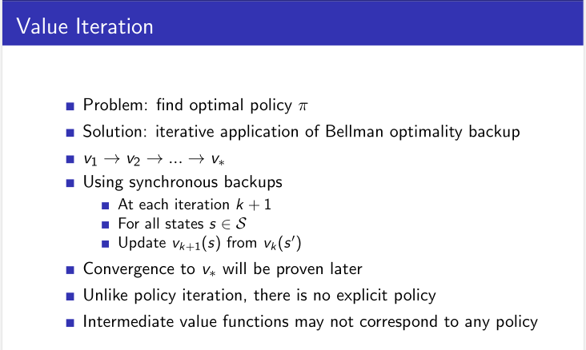
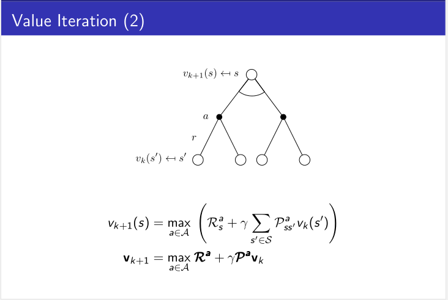
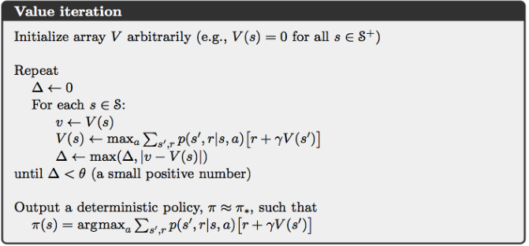
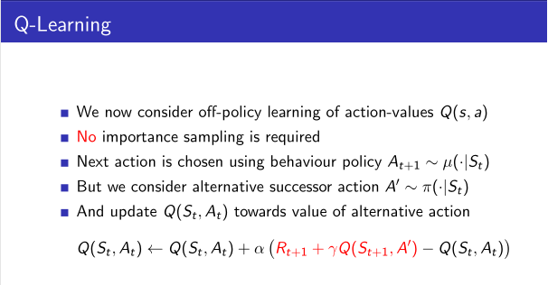
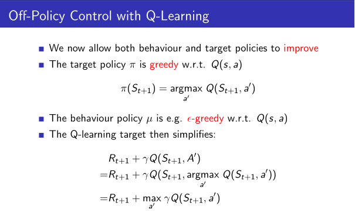
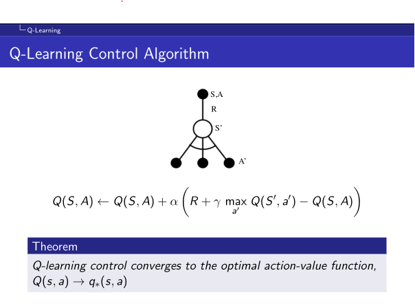
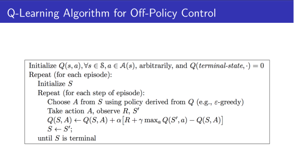
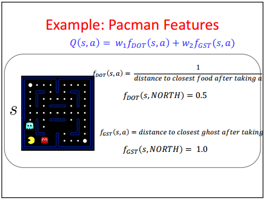
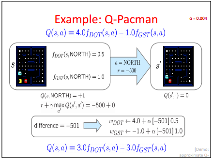

# Project 1: Reinforcement Learning

The whole project only need us to edit three files, and in fact, the `analysis.py` is not for the algorithms but instead some configurations or parameters to make agent run as wish.

As for the algorithms, there are three to implement, the `value iteration`, `Q-learning` and `approximate Q-learning`.

At the very beginning, it's pretty hard, since we have no idea what we really need to do, for example, should we pay attention to the moving directions and their corresponding consequences, like when hitting the wall, stay the original position?

And as time going and dig into the `util.py`, `gridworld.py` and tried different parameters via the console, and what's more, look the behaviors of a `REFERENCE` program wrote by others from the github [Yeap, but not a single glance at their code before finished myself, but maybe it does not matter], things gets much more clear, what we need to do is pretty small, just pile up all the functions/methods and implement the most bottom ones and we are done.

## valueIterationAgents.py 

> A value iteration agent for solving known MDPs.

Value iteration and policy iteration are two main methods for solving known MDPs, and they are similar in the formulas, and to be honest, I am so clear about their differences. -.-

Back to value iteration, the ppts is pretty clear to me by far (doubt about whether it will remains familiar latter).





Intuitively, we calculate the current state's value by weighting the nearby ones, say, let's assume we are robots in a GridWorld, if we take an action, let it be `WEST`, our current state's **new** value ($V_{k+1}(s)$) equals to the cost of the movement (`Reward`) and the **western** state's value ($V_k(s')$) by a `discount` ($\gamma$) [discount makes the nearby states counts more while the farer ones count less].

And we want to maximize the new value, so we take all possible actions and choose the one with biggest value, and that's it.

And in fact, we have not consider the `possibility` by far, if the movements are not determinate, then the $p$ means we take an `WEST` action, there are little chances we got the `NORTH` or `SOURTH` (and possible `EAST`), so the next state changes accordingly, but no big problem, we just do an addition and things back to what we said just now.

So, in implements, for a single Q(state, action) value, can be something like this:

``` python
def computeQValueFromValues(self, state, action):
    """
      Compute the Q-value of action in state from the
      value function stored in self.values.
    """
    successors = self.mdp.getTransitionStatesAndProbs(state, action)

    Q_value = 0.0

    for (nextState, prob) in successors:
        tmp_next_state_value = self.values[nextState]
        tmp_reward = self.mdp.getReward(state, action, nextState)
        Q_value += prob*(tmp_reward + tmp_next_state_value*self.discount) # pay attention to the discount and prob
    
    return Q_value
```

And the other functions are just calling this, no big deal.

The only trick/trap is that the values are updated **after a whole iteration/episode**, to be more specific, we need to freeze the values when do calculation and update them all when all new values are calculated, instead of changing it on the fly. Let's take an example, the calculation of `(3,4)` will needs the value of `(3,5)`, and when calc `(3,5)` it will also need `(3,4)`, so if we mix up, it may not be harmful (all will go to optimal eventually), but in that way we can not make sure after one iteration, the results are the same (since we can not make sure the states will be in the same order in different people's implements), maybe we calc `(3,5)` first, then `(3,4)` and others do it reversely.

## Q-learning






The updating formula comes from $Q(S_t, A_t)\leftarrow Q(S_t, A_t)+\epsilon(G_t-Q(S_t,A_t))$, while in this scene the $G_t=R+\gamma \underset{a'}{max}Q(S',a')$.

Another form of this equation is $Q(s,a) = (1-α)Q(s,a) + α(R(s,a,s') + (\underset{a'}{max} * Q(s',a')))$, while it can be treat as the addition of `(1-a)` times present and `a` times (Reward+next).

The difference from the value iteration example is that Q-learning is using the $Q(S,A)$ when updating itself, while value iteration is using nearby states. [SHOULD THIS BE RIGHT?]

The code is pretty straightforward, and no big trick.

## Approximate Q-learning

Just have a look at [cs63/s16/slides/3-25_approximate_Q-learning.pdf](https://www.cs.swarthmore.edu/~bryce/cs63/s16/slides/3-25_approximate_Q-learning.pdf), it is, awesome.

Pay attention to the **`feature`** part, in **PacMan features from lab** section, he presents four features. And in fact, the `feature`s are the most crucial parts when adopting the approximate Q-learning, since the code can behave quiet differently when using different features.

In implementation, it takes some efforts, unlike the Q-learning, we are always talking about `(state, action)`, the **features** here can and should be changed, so the algorithms should adapt to the changes. Anyway, the finished code is neat, while at the same time it is a little out of my scope even I actually wrote it. :)


### How and why the weights changes this way

The weight changes according to $$w_i=w_i+\alpha*difference*f_i(s,a)$$ while $$difference=R+\gamma \underset{a'}{max}Q(S',a') - Q(S,a)$$

And [cse473/16au/slides-16au/17-approx-rl.pdf](https://courses.cs.washington.edu/courses/cse473/16au/slides-16au/17-approx-rl.pdf) gives a demo to do calculation.





BUT, WHY?

see [how-to-fit-weights-into-q-values-with-linear-function-approximation](https://stats.stackexchange.com/questions/187110/how-to-fit-weights-into-q-values-with-linear-function-approximation)

### Features

As what have been said above, the features is more than crucial, and how can we get promising features?

* [in-q-learning-with-function-approximation-is-it-possible-to-avoid-hand-crafting](https://stackoverflow.com/questions/27370495/in-q-learning-with-function-approximation-is-it-possible-to-avoid-hand-crafting)
* [A Brief Survey of Parametric Value Function Approximation](http://www.cs.utexas.edu/~dana/MLClass/RL_VF.pdf)


## Books and other references

**NOTE: I have not read these yet!**

* [Richard S. Sutton](http://incompleteideas.net/sutton/index.html)
The guy who writes (with another one) ["Reinforcement Learning: An Introduction"](http://incompleteideas.net/sutton/book/bookdraft2016sep.pdf) 
* [The Quest for Artificial Intelligence: A History of Ideas and Achievements](http://ai.stanford.edu/~nilsson/QAI/qai.pdf)
A broad and general introduction to AI
* [FTML-RLTutorial](http://people.csail.mit.edu/agf/Files/13FTML-RLTutorial.pdf)
The categories seems nice.

## Codes

And, at last and as usual, for an engineer, codes are always welcomed:

* [dennybritz/reinforcement-learning](https://github.com/dennybritz/reinforcement-learning)