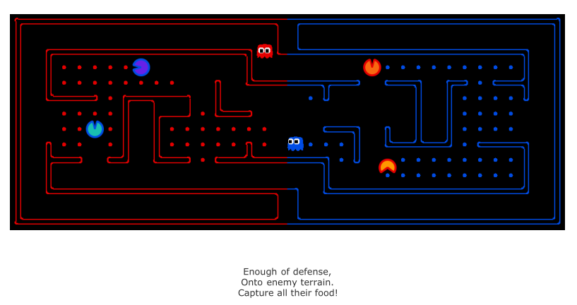
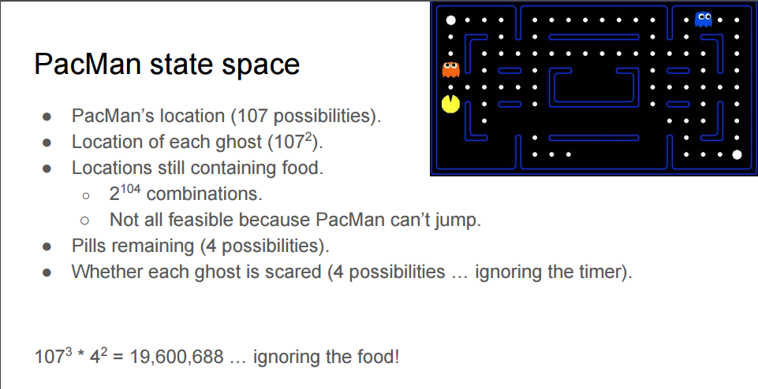
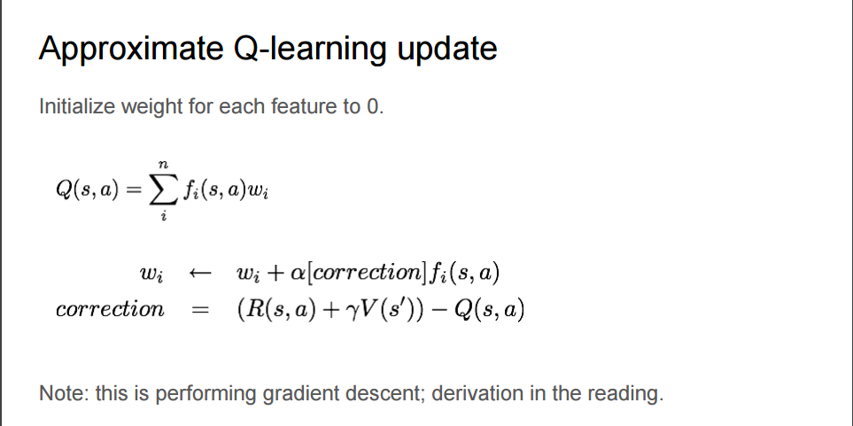
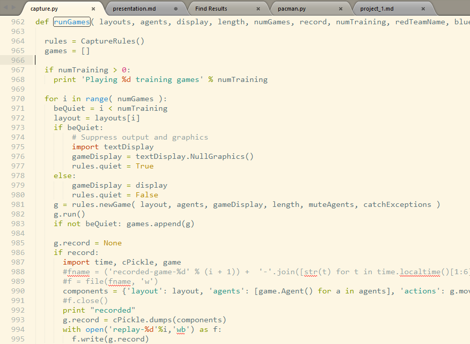
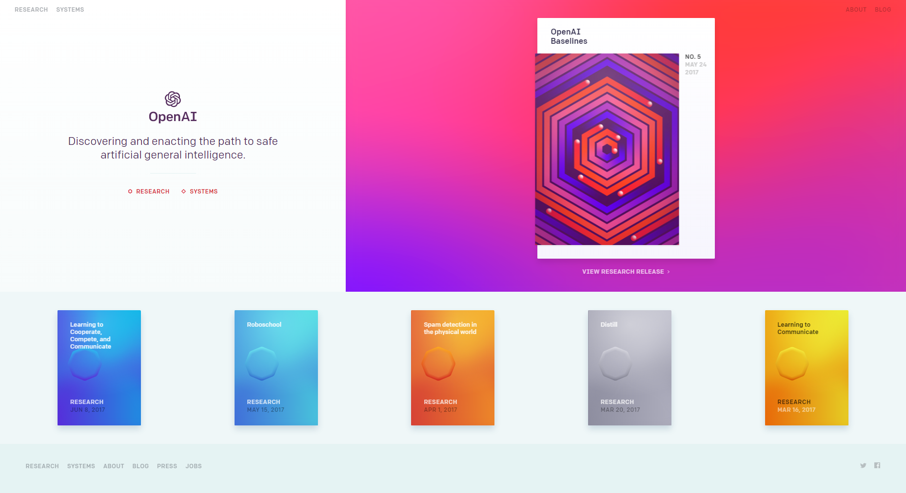
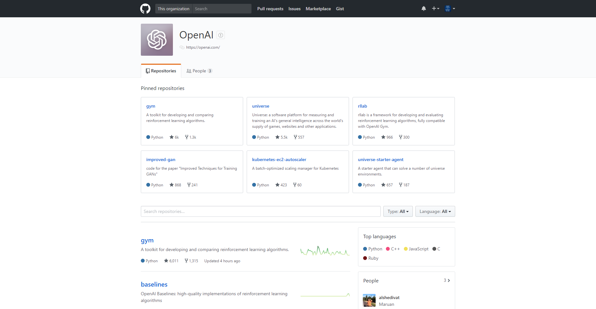

% Advanced AI Project<br> Pacman Capture the Flag <br>
% Wanshu Liu 刘莞姝 <br> 2016218037 <br> <br> MiaoDX 缪东旭 <br> 2016218041 <br>
% June 6, 2017


{width=85%}

## How?

* Strategy
* Reinforcement Learning based control

## Strategy

> Pay attention to the RULES!

. . .

Our strategy is dead simple:

* Enough of defense, Onto enemy terrain. Capture all their food!
* Enough of eating, back and save!

. . .

> If this move limit is reached, whichever team has returned the most food wins. 

Intuitively, if we eat some and save, the risk will be much lower.

## HOW TO?

We extends the `OffensiveReflexAgent` class in `baselineTeam.py` to provide the ability to come back and save when eaten some food (say five).

* `getFeatures`
* `getWeights`

. . .

The weights are fixed:

``` python
{
    "successorScore": 30, # the negative remaining foods number
    "ghostDistance": 3,
    "distanceToFood": -2, # distance to closet food
    "stop": -50,
    "reverse": -5,
    "homeDistance": -20
}
```

***

The features vary a little:

When eating:

``` json
{
    "successorScore": ...,
    "ghostDistance": ...,
    "distanceToFood": ...,
    "stop": ...,
    "reverse": ...
}
```

. . .

When backing:

``` python
[...]
if now_state.numCarrying >= 5 or len(opponent_food_left_now) <= 2:
    [...]
```

``` json
{
    "successorScore": 0.0,
    "ghostDistance": ...,
    "distanceToFood": 0.0,
    "stop": ...,
    "reverse": ...,
    "homeDistance": ...
}
```

***

And, another little trick:

Whenever we enter the opponent side, we set our back reference point (where we will go towards when backing) randomly from the remaining food of our side (if no left, remains the former one). So, our backing strategy have some *ability to behave randomly*.

. . .

And that's it.

## Improvements

> Finally, you can access the list of noisy distance observations via **getAgentDistances**. These distances are within 6 of the truth, and the
noise is **chosen uniformly** at random from the range [-6, 6] (e.g., if the true distance is 6, then each of {0, 1, ..., 12} is chosen with
probability 1/13). You can get the **likelihood** of a noisy reading using **getDistanceProb**.

. . .

There is one team on the github, [danxmoran/pacmanCTF](https://github.com/danxmoran/pacmanCTF):

> All agents created for this project determine actions to take via a combination of Hidden Markov Model inference (for tracking opponent positions) and expectimax search (for looking into the future assuming the tracked opponent positions). 

It is awesome.

***

So, we can combine it with our team, especially the **Hidden Markov Model inference** part to make our opponent agent's position much more determinate. And all other code remains unchanged:

``` python
[...]
ghosts_distance = [self.getMazeDistance(successor_pos, g_pos) for g_pos in enemy_ghosts_pos]
[...]
```

. . .

## Reinforcement Learning based control

* Value Iteration
* Q-learning
* Approximate Q-Learning

. . .

{width=55%}

Picture from [cs63/s16/slides/3-25_approximate_Q-learning.pdf](https://www.cs.swarthmore.edu/~bryce/cs63/s16/slides/3-25_approximate_Q-learning.pdf)

***

And in fact, we are already used some of the Approximate Q-learning, the feature and wight part we mentioned can be treat as the `test` phase of it.

. . .

{width=55%}

Picture from [cs63/s16/slides/3-25_approximate_Q-learning.pdf](https://www.cs.swarthmore.edu/~bryce/cs63/s16/slides/3-25_approximate_Q-learning.pdf)

***

### The difficulties of using Approximate Q-learning

So we can update our features' weight and it will enhance our agents.

. . .

However, unlike the project 1, we can not set the agent's features and corresponding weights and let the framework do the reward calculate and update job, it's not so straightforward in project 2.

Even there is the possible API (`runGames`) for training and updating:

***

{width=55%}

We still have no idea of how to use it for our purpose. And we are more than happy to discuss if you know how to use it.

## Future work

As for RL, the crucial part is the ability to update, so in a limited environment, we are somewhat stick to the implements of a single game, not too easy to extend our knowledge on other project or environments.

And there are some companies/projects aiming at this:

[openai.com](https://openai.com/)

***

The openai:

<div id="openai">
{width=45%}
{width=45%}
</div>

***

Some environments of openai gym:


## 