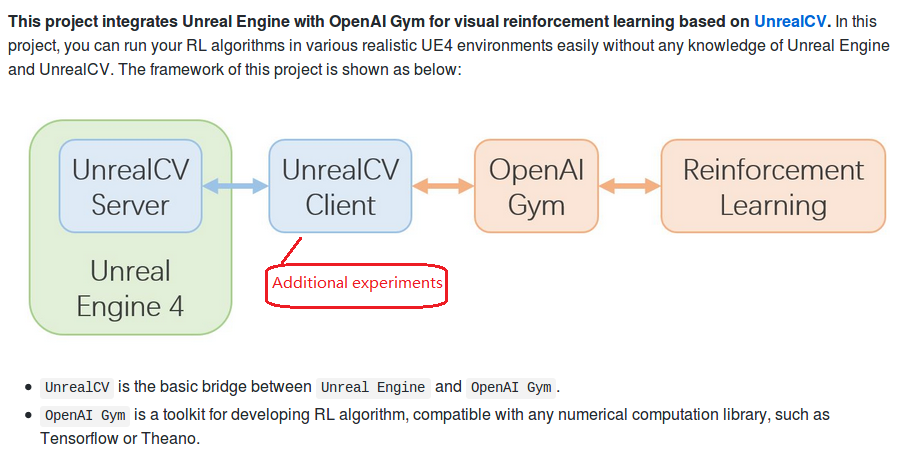

% Synthetic computer vision:<br>get our hands dirty
% MiaoDX 缪东旭 <br> 2016218041 <br>mioadx @hotmail.com / @tju.edu.cn
% June 15, 2017

# Introduction

***
## What I am doing?

* Get synthesized datasets from virtual environments
* Use the datasets for computer vision algorithms
* Combine virtual environments with Reinforcement Learning (ML/DL)

***
## Why it (synthetic way) matters?

* Create database with ease
* Configurable environments
* Repeatable experiments
* Accurate ground truth

***

{width=80%}

***
## What we can do with all these?

* Collecting data 
* Training set for algorithms
* Evaluating existing algorithms (extra testing set)
* Integrating it with other platforms and provide potential improvements for current algorithms

***
## Synthetic computer vision & Computer Graphics

Take advantage of existing advance in rending/texture/simulation ... technologies:

To be more specific, we concentrate on one of the most widely used game engine -- Unreal 4

And what's more, it is open-sourced.

[It can generate highly `near-photo-realistic indoor scenes` and simulation of various physical movements]

***
## Beyond Graphics?

The ML/DL/RL is an pretty hot area now, and we are expected to have the ability when we are seeking a job.

So, get our toes wet with it is worthy and this project can do some help to it. Especially the combination of virtual world with RL algorithms part.

Plus, it's interesting :)

# Changelog

This project have changed a lot from the very beginning.

Dropped:

* GTA V
* Physical engine

Added:

* gym-unrealcv

# Project Overview

. . .

> We don't produce water. We are porters of nature.

I am not create something new, rather I reproduce/combine existing projects and provide a systematic guideline for newbies.

***
## General View

{width=70%}

Picture changed from [zfw1226/gym-unrealcv](https://github.com/zfw1226/gym-unrealcv)

We add some examples on the unrealcv side.

***
## General View -- the outline

* Main subject
    - unrealcv
    - gym_unrealcv

* System/hardware requirements
    - Ubuntu 16.04
    - GPU (GTX 980 tested)

* Software/Libraries
    - CUDA 8.0
    - Anaconda
    - docker
    - Opencv 2.4.13
    - python 2.7
    - tensorflow(-gpu)
    

* Demo usages
    - faster rcnn
    - Deep Q-Learning

***
## Step by step guide

The guide to set up the whole environment can be found in [my write-ups](this is a website page)

***
## What I have done?

Expect the set up of the environments (which is not so easy)

* Integrate unrealcv with faster rcnn tensorflow implements
* Demo of how to evaluate the existing algorithms

# Case study

***
## Get images (Official Demo)

``` python
# This is a 10 lines python example to show how to generate an image dataset with image, depth and object_mask.
# Read https://unrealcv.github.io/tutorial/getting_started.html before trying this script
# Note: if you need high-accuracy depth, please use `vget /camera/0/depth depth.exr`
import json; camera_trajectory = json.load(open('camera_traj.json'))
from unrealcv import client
client.connect()
# Get object information
obj_info = client.request('vget /objects')
for [loc, rot] in camera_trajectory:
    # Set position of the first camera
    client.request('vset /camera/0/location {x} {y} {z}'.format(**loc))
    client.request('vset /camera/0/rotation {pitch} {yaw} {roll}'.format(**rot))
    # Get image and ground truth
    modes = ['lit', 'depth', 'object_mask']
    [im, dep, obj] = [client.request('vget /camera/0/%s' % m) for m in modes]
    print ['%s is saved to %s' % (k, v) for (k,v) in zip(modes, [im, dep, obj])]
```


***
## Gym_unrealcv (Official Demo)

* Random agent
* DQN

***
## Faster rcnn

The official demo need the [rbgirshick/py-faster-rcnn with caffe support](https://github.com/rbgirshick/py-faster-rcnn), which can be not so easy to use.

I integrate/test two tensorflow implements, and all instructions can be found at [my write-ups](this is a website page).


***
## Test algorithms with synthetic data

We show a demo of using different color of sofa generated from the unrealcv and test the faster rcnn implements to see whether they are invariant to color.

Codes can be found at [codes](the code)

# Related Work

We only cover a small aspect of synthetic computer vision:

* Synthetic dataset
* Composite Images
* Virtual/Augmented Reality
* AI2-THOR (The House Of inteRactio, it is highly similar to unrealcv, used Unity 3D)
* ...

More can be found at [unrealcv/synthetic-computer-vision list](https://github.com/unrealcv/synthetic-computer-vision)


# Conclusion

* Drawbacks/future improvements of synthetic data
* Transfer of knowledge

***
## References

Online resources:

* Real-Time Physics Simulation, [http://bulletphysics.org/](http://bulletphysics.org/)
* Games engines, [https://github.com/showcases/game-engines](https://github.com/showcases/game-engines)
* synthetic-computer-vision, [https://github.com/unrealcv/synthetic-computer-vision](https://github.com/unrealcv/synthetic-computer-vision)
* unrealcv, [https://github.com/unrealcv/unrealcv](https://github.com/unrealcv/unrealcv)
* py-faster-rcnn, [https://github.com/rbgirshick/py-faster-rcnn](https://github.com/rbgirshick/py-faster-rcnn)
* OpenAI gym, [https://github.com/openai/gym](https://github.com/openai/gym)
* OpenAI universe, [https://github.com/openai/universe](https://github.com/openai/universe)
* OpenAI roboschool, [https://github.com/openai/roboschool](https://github.com/openai/roboschool)

***

Papers:

* UnrealCV: Connecting Computer Vision to Unreal Engine, [https://arxiv.org/abs/1609.01326](https://arxiv.org/abs/1609.01326)
* Target-driven Visual Navigation in Indoor Scenes using Deep Reinforcement Learning, [https://arxiv.org/abs/1609.05143](https://arxiv.org/abs/1609.05143)
* Faster R-CNN: Towards Real-Time Object Detection with Region Proposal Networks, [https://arxiv.org/abs/1506.01497](https://arxiv.org/abs/1506.01497)
* An Implementation of Faster RCNN with Study for Region Sampling, [https://arxiv.org/pdf/1702.02138.pdf](https://arxiv.org/pdf/1702.02138.pdf)
* Learning Physical Intuition of Block Towers by Example, [https://arxiv.org/abs/1603.01312](https://arxiv.org/abs/1603.01312)
* Using Virtual Worlds, Specifically GTA5, to Learn Distance to Stop Signs, [http://orfe.princeton.edu/~alaink/SmartDrivingCars/DeepLearning/GTAV_TRB_Final.pdf](http://orfe.princeton.edu/~alaink/SmartDrivingCars/DeepLearning/GTAV_TRB_Final.pdf)

***
## That's all

Great thanks to Ms. Wan for your classes and project assignment.

And all of our classmates.

. . .

What's more, it's my last presentation in first year of graduate life.

> Good Luck & Have Fun!<br>
> MiaoDX
