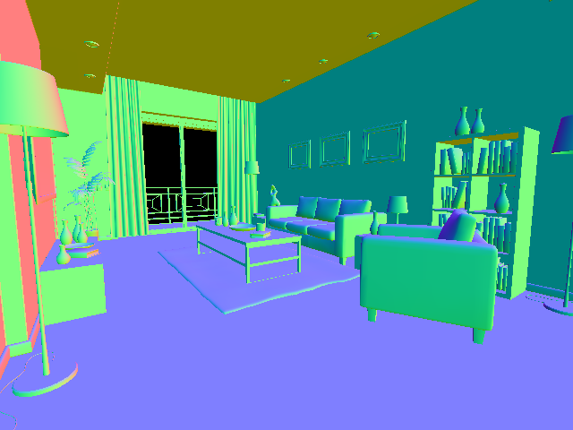

% Synthetic   computer vision:  get our hands dirty
% MiaoDX 缪东旭   2016218041  mioadx @hotmail.com / @tju.edu.cn
% May 18, 2017

## Project Name changed

* A survey of ways to synthesize data (images) with Simulation Software.

* [A survey of synthetic computer vision](https://miaodx.github.io/2017/05/11/blogs/synthesis/survey_of_synthetic_computer_vision/)

. . .

Since the `SERVEY` can be too large for me to cover, and what I intend to do is replicating the results of some papers and try some tools and get familiar with all these stuff, so I changed my project name into:

***

## Synthetic computer vision:  get our hands dirty

# Why -- motivation

* personal preference
* pros and cons (real world/synthetic data)
    - available
    - privacy    
    - controllable
    - accuracy

. . .

Question about `human level accuracy`   -- Andrew Ng in his 『Nuts and Bolts of Applying Deep Learning』

***

{width=75%}

. . .

AND back to our motivation, there are plenty of prior works ...

***

## plenty of prior works #1

. . .

OpenAI
    
* [gym](https://github.com/openai/gym):    
    
    A toolkit for developing and comparing reinforcement learning algorithms.
    
* [universe](https://github.com/openai/universe):
    
    A software platform for measuring and training an AI's general intelligence across the world's supply of games, websites and other applications.
    
* [brand new roboschool](https://github.com/openai/roboschool):    
    
    Open-source software for robot simulation

***

## plenty of prior works #2

Google scholar `synthetic computer vision` results:

{width=50%}

***

## plenty of prior works #3

[synthetic-computer-vision,  A list of synthetic dataset and tools for computer vision](https://github.com/unrealcv/synthetic-computer-vision):

{width=30%}
{width=30%}
{width=30%}

# Outline

. . .

There are (at least) three main fields of synthetic systems:

* Physics Simulations, like Bullet, Havok, MuJoCo, ODE and PhysX, etc
* Game Engines, like Unity3D, Unreal, cocos2d-x, godot and so on
* Closed source games with (unofficial/community) API for developer, like GTA V

. . .

The first one can be part of the second one, and for synthetic computer vision, the second and third one can be more appealing and suitable since they provide abundant images in various scenarios, and what's more, they looks really real.

***

## Some example images/videos from the field listed above

***

### Example#1 Bullet

<video data-src="pics/Bullet_2.86_VR_haptics_glove.mp4" width="75%" controls="controls" type="video/mp4">
</video>

Bullet 2.86 VR haptics glove.

***

### Example#2.1 Unreal 4

<video data-src="pics/Photorealistic_Character_Sample.mp4" width="75%" controls="controls" type="video/mp4">
</video>

Photorealistic Character Sample

***

### Example#2.2 Unreal 4 -- unrealcv

{width=35%}
{width=35%}
{width=35%}
{width=35%}

***

### Example#3 GTA V

<video data-src="pics/GTA_V.mp4" width="75%" controls="controls" type="video/mp4">
</video>

GTA V official trailer

# Planed experiments

***

Papers/experiments I want to replicate or tools I want to try:

* \* [unrealcv](https://github.com/unrealcv/unrealcv):  Connecting Computer Vision to Unreal Engine

* \* [Using Virtual Worlds, Specifically GTA5, to Learn Distance to Stop Signs](http://orfe.princeton.edu/~alaink/SmartDrivingCars/DeepLearning/GTAV_TRB_Final.pdf)

* \* [DeepGTAV](https://github.com/ai-tor/DeepGTAV):    A plugin for GTAV that transforms it into a vision-based self-driving car research environment.

* [AirSim](https://github.com/Microsoft/AirSim):    Open source simulator based on Unreal Engine for autonomous vehicles from Microsoft AI & Research 

* \* [openai gym](https://github.com/openai/gym):   A toolkit for developing and comparing reinforcement learning algorithms.
    
* [openai universe](https://github.com/openai/universe):    A software platform for measuring and training an AI's general intelligence across the world's supply of games, websites and other applications.
    
* \* [openai roboschool](https://github.com/openai/roboschool): Open-source software for robot simulation

# Timeline

{width=45%}

To be more specific:

* Week 3: unrealcv
* Week 5: DeepGTAV
* Week 6: openai gym & openai roboschool
* Week 7-8: paper work

***

## That's all, thank you

>Good luck & have fun.

By MiaoDX 缪东旭