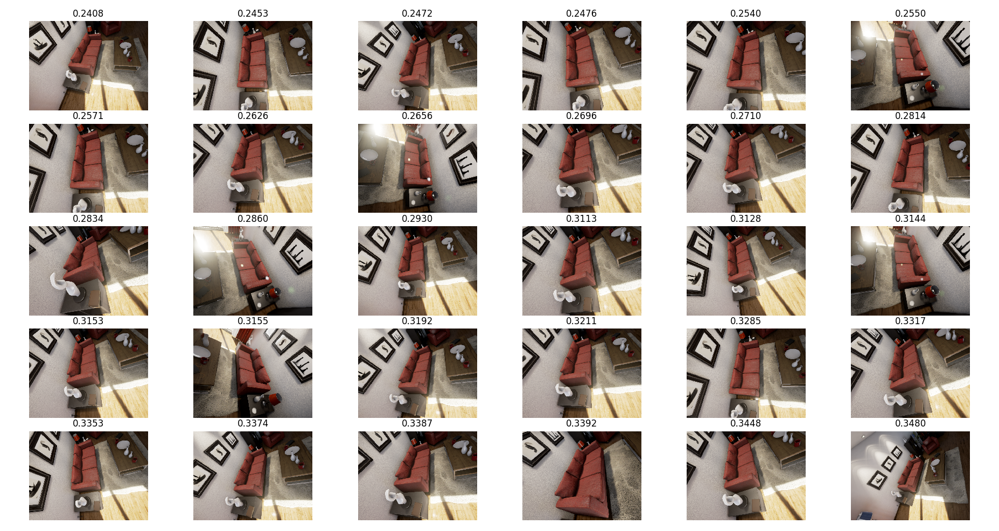

% Synthetic computer vision:<br>get our hands dirty
% MiaoDX 缪东旭 <br> 2016218041 <br>mioadx @hotmail.com / @tju.edu.cn
% June 15, 2017


\begin{abstract}

Getting dataset in synthetic ways/virtual environments and train Deep Learning algorithms on them or integrating algorithms with virtual environment world directly have been a trendy recently, mainly due to the potential advantages of virtual or synthetic way over real world ways in the easiness, repeatability, and economical effects.

This project gives a guidance of getting and using synthetic dataset, mainly concentrate on unrealcv and related gym-unrealcv project.

\end{abstract}

\keywords{Synthethic computer vision, Virtual Environment, Unrealcv}

# Introduction


With the great developments and massive usage of Machine Learning and recently Deep Learning, the demand for large and accurate dataset is more than ever. And since collecting real world data is sometimes not so accurate and not repeatable, say we want shooting the objects under different lighting environments, it is pretty hard to control the irrelevant lighting sources like the daylight and it is almost impossible to make the experiments again with the exact same configuration.

And then labeling the dataset by human labor after we actually get dataset in real world is costly, time-consuming and error-prone. So it would be great if we can get repeatable, accurate, low-cost, easy to get dataset and it would be better if we can configure the environments as we wish, and the synthetic way of generating dataset then train on them is getting more and more attention recent years and is a good candidate for our purpose, like \cite{DBLP:journals/corr/QiuY16}, \cite{DBLP:journals/corr/ZhuMKLGFF16}, \cite{DBLP:journals/corr/LererGF16} and \cite{renNIPS15fasterrcnn}.

{#fig:unrealcv_showcase width=75%}

Figure \ref{fig:unrealcv_showcase} gives an example of synthetic data get from unrealcv, which integrates the Unreal 4 game engine with computer vision. We can see from the images that the result is near-photo-realistic, and we get 100% repeatable results from it, the time of generating data is much more quicker than in real world, in our experiments we generated 8000 images in around 36.37 minutes in a normal PC with i7 CPU.

After the dataset is collected, we can use them to train algorithms, or use them as extra testing set to evaluate existing algorithm, which we will give an example in the experiments of using the generated dataset to test the performance of [one tensorflow implements of faster rcnn](https://github.com/smallcorgi/Faster-RCNN_TF).


And we also demonstrate the usage of gym-unrealcv, which integrates the unrealcv with other platforms, openai gym to be exactly, and provide environments for training Reinforcement Learning algorithms to control agents and do tasks in the virtual environments.

## Related Work


We will only cover a small aspect of synthetic computer vision in this project, that is the way to get synthetic dataset and use them to evaluate existing algorithms, there are many more other applications, like composite images, Virtual/Augmented Reality and so on.

There is many other projects similar to what we chosen, AI2-THOR (The House Of inteRactio) for example, which it is highly similar to unrealcv, using Unity 3D as the game engine. And [UETorch](https://github.com/facebook/UETorch) is an Unreal Engine 4 plugin that adds support for embedded Lua/Torch scripts in the game engine loop, and a set of Lua APIs for providing user input, taking screenshots and segmentation masks, controlling game state, running faster than real time, etc.

And there are many online resources, like [Real-Time Physics Simulation](http://bulletphysics.org/), and the openai projects, [gym](https://github.com/openai/gym), [universe](https://github.com/openai/universe) and [roboschool](https://github.com/openai/roboschool). The papers about of getting and using data in synthetic ways is getting more these years, to name a few, \cite{DBLP:journals/corr/QiuY16} is what our projects based on, the authors provide an unrealcv, a open-source tool to help create new virtual worlds and show how to integrate it with computer vision research, and the authors of \cite{DBLP:journals/corr/ZhuMKLGFF16} provide a similar environments, they propose AI2-THOR framework, which provides an environment with high-quality 3D scenes and physics engine, their framework enables agents to take actions and interact with objects. However, they are closed-source (by far).

In \cite{DBLP:journals/corr/LererGF16}, the authors explore the ability of deep feed-forward models to learn intuitive physics generated by UETorch said above.
and [Using Virtual Worlds, Specifically GTA5, to Learn Distance to Stop Signs](http://orfe.princeton.edu/~alaink/SmartDrivingCars/DeepLearning/GTAV_TRB_Final.pdf) is also interesting.

What is more, many other similar projects and papers can be found at [unrealcv/synthetic-computer-vision list](https://github.com/unrealcv/synthetic-computer-vision).

# Our Work

## Project Overview

In this project we am not proposing something brand new, rather we reproduce/combine existing projects and provide a guidance to get systematic dataset and then use them on various occasions for newbies. To be more clear, in this project we are going to show how to:

* Get synthesized datasets from virtual environments
* Use the datasets for evaluating computer vision algorithms
* Combine virtual environments with Reinforcement Learning (ML/DL)

As we have shown in Figure \ref{fig:unrealcv_showcase}, we are talking mostly about unrealcv in this projects, it provide a bridge between Unreal 4, one of the mostly widely used game engines and the computer vision world. Thus we can take advantage of existing technology advances in lighting, cameras, materials, shaders & textures, particles & visual effects and more provided by the Unreal 4 game engine and what more, it is totally open sourced and not limited to specific virtual world and the usage is pretty easy, so it is promising one at presents.


{#fig:gym_unrealcv width=85%}

Figure \ref{fig:gym_unrealcv} is copied and changed from [zfw1226/gym-unrealcv](https://github.com/zfw1226/gym-unrealcv), we add some examples on the unrealcv side, specifically, generating dataset and test one of faster rcnn implements.


## The outline of this project

* Main subject
    - unrealcv
    - gym_unrealcv

* System/hardware requirements
    - Ubuntu 16.04
    - GPU (GTX 980 tested)

* Software/Libraries
    - CUDA 8.0
    - Anaconda
    - docker
    - Opencv 2.4.13
    - python 2.7
    - tensorflow(-gpu)
    

* Demo usages
    - generate dataset
    - evaluate faster rcnn

The Unreal 4 game engine has limited support for Linux platform, however, the other software and libraries have full supports for Linux, so for convenient, Ubuntu 16.04 is chosen as our experiments platform, and the training or testing phase of Deep Learning or Reinforcement Learning need the GPU support, better a better one. Other software and/or libraries includes CUDA 8.0 for the GPU, opencv for processing, showing and saving images, python is the language all of our chosen projects used, the python environments is created and managed by Anaconda, which provide a standalone environments for the developments. Tensorfow-gpu is provided by the official team.

We will set up all the environment and configuration of unrealcv and related gym_unrealcv, and then generate dataset from the unrealcv through programs and use them to evaluate the one of the faster rcnn tensorflow implement.


## Step by step guide

The guide to set up the whole environment can be found in [my write-ups](https://github.com/MiaoDX/unrealcv_examples/blob/master/installation_and_set_up.md).

There are some things needs to be noticed, firstly, the GPU/CUDA configuration is not so easy for the first time so take care, and the opencv should be build from source to be used for GUI work (at least in my situation) or you can have a look at [menpo/opencv3](https://anaconda.org/menpo/opencv3). And the tensorflow-gpu provided by anaconda is not so updated and compatible, so please use the official one. All others are pretty straightforward and you can follow my guide.


# Experiments and Results

## Get images (Official Demo)

The way to get familiar with the unrealcv is have a look at the official `10 lines example` listed as below:


``` python
# This is a 10 lines python example to show how to generate an image dataset with image, depth and object_mask.
# Read https://unrealcv.github.io/tutorial/getting_started.html before trying this script
# Note: if you need high-accuracy depth, please use `vget /camera/0/depth depth.exr`
import json; camera_trajectory = json.load(open('camera_traj.json'))
from unrealcv import client
client.connect()
# Get object information
obj_info = client.request('vget /objects')
for [loc, rot] in camera_trajectory:
    # Set position of the first camera
    client.request('vset /camera/0/location {x} {y} {z}'.format(**loc))
    client.request('vset /camera/0/rotation {pitch} {yaw} {roll}'.format(**rot))
    # Get image and ground truth
    modes = ['lit', 'depth', 'object_mask']
    [im, dep, obj] = [client.request('vget /camera/0/%s' % m) for m in modes]
    print ['%s is saved to %s' % (k, v) for (k,v) in zip(modes, [im, dep, obj])]
```

So we can set the location and rotation of the camera and the mode of the scene: `lit` (normal), `depth`, `object_mask` (and not showing `normal`) with ease by `vset` and `vget` and corresponding parameters. So when we want to generate dataset we only need to provide the location and rotation of camera and modes is enough.


## Gym_unrealcv (Official Demo)

* Random agent
* DQN

The gym_unrealcv project provide two example, one random agent who move randomly in the home to find the target (the plants). And a Deep Q-learning agent who can learn how to avoid obstacle and try to get the target as soon as possible.

The experiment is pretty easy to follow under the official guidance, we did a experiment ran 2061 epochs, and the reward is shown in Figure \ref{fig:gym_unrealcv_reward}, it is clear that there is an trendy of getting better results as the running as we expected, and in Figure \ref{fig:gym_unrealcv_traj} we plot the trajectories of the steps in 0-100, 400-500, 800-900, 1200-1300, 1600-1700 and  1900-2000 epochs respectively. We can see from the figure that we are actually getting better results, since there are more red line indicating that the agents found target object successfully in the end.

{#fig:gym_unrealcv_reward width=70%}

{#fig:gym_unrealcv_traj width=80%}


## Test algorithms with synthetic data

### Generate datasets

We show a demo of using different color of sofa generated from the unrealcv and test the faster rcnn implements to see whether they are invariant to color.

Codes can be found at [MiaoDX/unrealcv_examples](https://github.com/MiaoDX/unrealcv_examples).

To generate images, we have a guideline, we want images have the `Couch_13` in the scene. And vary in the positions and rotations, the purpose is to generate a dataset to challenge existing algorithms implements for position and/or rotation changes and thus do evaluation.

After hand chosen some range points, we found that with below range we can  have a 1/4 sphere to choose points from.

``` vi
x:[-180,90]
y:[-200,150]
z:[75,230]
```

We then make the chosen points point to the position of `Couch_13`([180.000 0.000 60.000]) thus we get the rotation and translation and the roll angle is sampling randomly. So we get a proper 6-dof position which contains the couch. More info about the design principles can be found at [generate_images_design.md](https://github.com/MiaoDX/unrealcv_examples/blob/master/generate_images_design.md). Below are the running results:

``` vi
ᐅ python generate_images_unrealcv.py 
Total number: 8000
INFO:__init__:204:Got connection confirm: 'connected to RealisticRendering'
2017-06-16 01:02:35
1497546156.0
0/8000 ... 2017-06-16 01:02:35
100/8000 ... 2017-06-16 01:03:04
200/8000 ... 2017-06-16 01:03:32
300/8000 ... 2017-06-16 01:03:59
400/8000 ... 2017-06-16 01:04:29

[...]

7600/8000 ... 2017-06-16 01:37:17
7700/8000 ... 2017-06-16 01:37:42
7800/8000 ... 2017-06-16 01:38:07
7900/8000 ... 2017-06-16 01:38:33
2017-06-16 01:38:58
1497548338.49
Duration:2182.49328804s
```

So, it spent around 2182/60=36.37 minutes to generate 8000 images, much more quicker than in real world environments, the generated files are around 4.4GB. And Figure \ref{fig:8000_all} are a screenshot of the generated images.

{#fig:8000_all width=75%}


### Evaluate Faster rcnn

The (unrealcv) official demo use the [rbgirshick/py-faster-rcnn with caffe support](https://github.com/rbgirshick/py-faster-rcnn) \cite{renNIPS15fasterrcnn} to demonstrate how to integrate existing algorithms with unrealcv, which can be not so easy to set up and I personally like tensorflow since it's easy to use and better communities by far.

So I integrate/test one of the tensorflow implements, [smallcorgi/Faster-RCNN_TF](https://github.com/smallcorgi/Faster-RCNN_TF), and all instructions can be found at [my write-ups](https://github.com/MiaoDX/unrealcv_examples/blob/master/installation_and_set_up.md).

We use the generated images above to test the Faster-RCNN_TF, for each image, we get the the confidence score from the algorithm, and experiments whose score below 0.8 is treated as failures. The results are like below:

``` vi
Loaded network /home/miao/virtual_world/codes/faster_rcnns/Pretrained/VGGnet_fast_rcnn_iter_70000.ckpt
Init_tf done
init network done
Total number: 8000
0/8000 ... 2017-06-16 02:00:59
50/8000 ... 2017-06-16 02:01:10
100/8000 ... 2017-06-16 02:01:20
150/8000 ... 2017-06-16 02:01:30
200/8000 ... 2017-06-16 02:01:40

[...]

7750/8000 ... 2017-06-16 02:26:24
7800/8000 ... 2017-06-16 02:26:33
7850/8000 ... 2017-06-16 02:26:43
7900/8000 ... 2017-06-16 02:26:53
7950/8000 ... 2017-06-16 02:27:02
After calc, success ratio:0.955375, fail ration:0.044625

[...]

ALL DONE
1497551233.16
Duration:1573.80028796s
```

There are around 4.46% experiments failed in our test, which is pretty shocked to me, since I thought it make no sense because we are only testing the sofa (couch) class, and we have our camera point to the sofa already. And we will see what actually happened.

First, we give a intuitive evaluation experiment, Figure \ref{fig:6_dof_measure} shows the relation between score and every DOF (degreed of freedom) difference from the sofa, we can see from the figure that the bigger difference, the higher possibility of fail to recognize the sofa.

{#fig:6_dof_measure width=95%}

Then we draw the distribution of the score in Figure \ref{fig:score_number}, we can see from it that this implements behave pretty good, but have some points with low performance.

{#fig:score_number width=85%}


And we then look into the failed ones, we list the worst 30 images and their scores in Figure \ref{fig:worst_0_30}. There is a common character that looking the soft in a no frontal down view will probably not produce nice results. Great chances are that the training dataset used for training may lack sofas in such kind of view. And more not so good images are listed in the [... latter on]

{#fig:worst_0_30 width=80%}

Note that our experiments is pretty simple and more digest and quantization analysis is needed if we really want to evaluate the algorithms clearly and convictively. But back to our purpose, we are giving hints and guidances to use it, so that is it.


# Conclusion

And there are some drawbacks/future improvements of synthetic data, the data is not exactly like the real world, that said, we are limited to the performance of the game engine we used, however, since the game engine part is developed by a great community and have a leading company [Epic Games](https://www.epicgames.com/), they are improving the quality of the game engine massively and quickly, so we can get better quality datasets with little effort. The another potential problem is the transferring of knowledge when we use the synthetic dataset for training, it is a hot research area and much more process is expected to shown up in the following years.


# Acknowledgments

Great thanks to Ms. Wan for her classes and project assignment, especially the basic conception of graphics, like pin-hole camera geometry, camera matrix, lighting and many others. The freedom of project chosen is pretty nice, and the overall guidance of project is time consuming for her and at the same time make our project on schedule.


\bibliographystyle{abbrv}

\bibliography{sigproc}

\appendix
\section{Extra results of faster rcnn experiments}

We will list some of the not so good results in the faster rcnn experiments, and like the Figure \ref{worst_0_30.png}, every images contains 30 images and their corresponding confidence score, we listed images with score less that 60% or so. So we can see from the images that, it indeed have some problems for the no frontal top view of sofa.

{width=80%}

{width=80%}

{width=80%}

{width=80%}

{width=80%}

\balancecolumns