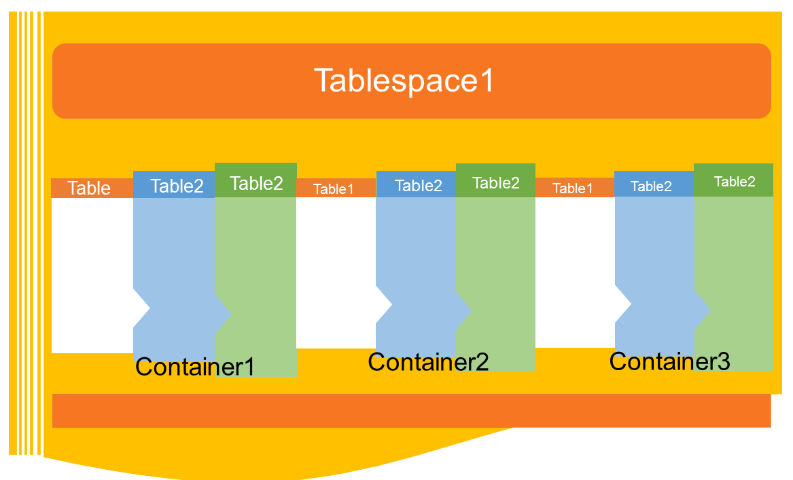
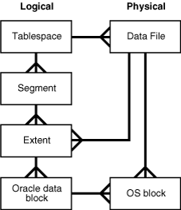
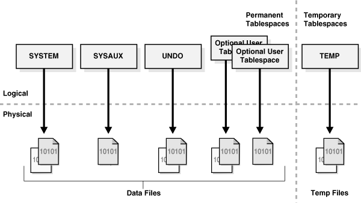

Compareation_of_tablespaces_in_db2_oracle_and_mysql

原来的作业要求是比较一下不同数据库中表的存储方式异同，考虑到自己对数据库一直都是不太了解，在查阅官方文档的同时也查询了一下不同数据库中术语的使用异同。

本文几乎全部摘录自互联网，版权归原公司/作者所有。部分内容进行整合与简单解释（**用粗体表示**），主要参考的内容链接为：

官方文档：

* [DB2 基础系列文章](https://www.ibm.com/developerworks/cn/data/zones/basics/)
    - [DB2 基础: 表空间和缓冲池](https://www.ibm.com/developerworks/cn/data/library/techarticles/0212wieser/index.html#ibm-pcon)
* [DB2 basics series](https://www.ibm.com/developerworks/data/newto/db2basics.html)
* [IBM® DB2® 11.1 for Linux, UNIX and Windows Knowledge Center](https://www.ibm.com/support/knowledgecenter/SSEPGG_11.1.0/com.ibm.db2.luw.welcome.doc/doc/welcome.html)
* [Oracle Database Concepts](http://docs.oracle.com/database/121/CNCPT/)
    - [12 Logical Storage Structures](http://docs.oracle.com/database/121/CNCPT/logical.htm#CNCPT004)
* [MySQL 5.5 Reference Manual](https://dev.mysql.com/doc/refman/5.5/en/)
    - [15.7 InnoDB Tablespaces](https://dev.mysql.com/doc/refman/5.7/en/innodb-tablespace.html)

互联网资料：

* [DB2 - Tutorial](http://www.tutorialspoint.com/db2/)
    - [https://www.tutorialspoint.com/db2/db2_tablespaces.htm](https://www.tutorialspoint.com/db2/db2_tablespaces.htm)
* [Comparison of different SQL implementations](http://troels.arvin.dk/db/rdbms/)
* [How to List All Tables and Describe Tables in Oracle, MySQL, DB2 and PostgreSQL](http://onewebsql.com/blog/list-all-tables)
* [Relationship between catalog, schema, user, and database instance](http://stackoverflow.com/questions/7942520/relationship-between-catalog-schema-user-and-database-instance)
* [Oracle表空间（tablespaces）](http://www.cnblogs.com/fnng/archive/2012/08/12/2634485.html)

\newpage

# 同一名称在不同的数据库中有可能会有不同的含义

[Relationship between catalog, schema, user, and database instance](http://stackoverflow.com/questions/7942520/relationship-between-catalog-schema-user-and-database-instance)

To compare databases of different vendors (Oracle, SQL Server, DB2, MySQL, and PostgreSQL) how can I identify any object uniquely and do I need a catalog? For instance, In Java's DatabaseMetadata I should specify catalog and schema fooPattern at least.

Is it true that catalog is just an abstraction of data storage?

*votes 数最多的答案摘录如下：*

## In Oracle:

* server instance == database == catalog == all data managed by same execution engine
* schema == namespace within database, identical to user account
* user == schema owner == named account, identical to schema, who can connect to database, who owns the schema and use objects possibly in other schemas
* to identify any object in running server, you need (schema name + object name)

## In PostgreSQL:

* server instance == db cluster == all data managed by same execution engine
* database == catalog == single database within db cluster, isolated from other databases in same db cluster
* schema == namespace within database
* user == named account, who can connect to database, own and use objects in each allowed database separately
* to identify any object in running server, you need (database name + schema name + object name)

## In MySQL:

* server instance == not identified with catalog, just a set of databases
* database == schema == catalog == a namespace within the server.
* user == named account, who is can connect to server and use (but can not own - no concept of ownership) objects in one or more databases
* to identify any object in running server, you need (database name + object name)

## In Microsoft SQL Server:

* server instance == set of managed databases
* database == namespace qualifier within the server, rarely referred to as catalog
* schema == owner == namespace within the database, tied to database roles, by default only dbo is used
* user == named account, who can connect to server and use (but can not own - schema works as owner) objects in one or more databases
* to identify any object in running server, you need (database name + owner + object name)

So I think answer to your questions is:

It depends on implementation, whether catalog name is needed to identify objects. The meaning of "catalog", "schema" and "database" vary from one implementation to another.

Yes, a catalog is an abstraction of data storage. I think it should be also defined as a self-contained isolated namespace, but not all SQL engines do it.
Database and schema are pretty well defined by all vendors. Catalog is sometimes synonymous to "database" (at least in Oracle and Postgres), sometimes synonymous to "schema", and sometimes synonymous to both. The term catalog also often means metadata collection (aka system tables).

## *对应于 DB2 的答案:*

For DB2, schema is used as namespaces. So if you want to uniquely identify an object in a database you would say *schema.object_name*. This is a very handy way to achieve multitenancy. You can have a separate schema for each tenant in your database. This provides for good separation of concerns from both security as well as management aspects. You can have 32K schemas in a single DB2 database.

A catalog in DB2 is simply a collection of system tables that contain metadata about the database. In general, it is considered a bad practice to access catalog objects directly. It is best to use the facilities provided by your API (e.g. JDBC) to explore the catalog and the metadata it contains.

DB2 also has other abstraction layers. You can have multiple instances of DB2 running on the same machine. Each instance can manage 256 separate databases (each with 32K schemas). The number of DB2 instances on a server is limited only by the amount of memory you have available. At one point in time we had 120 instances of DB2 (each with one database and 10 connections) running on Amazon EC2 m1.large. You can also have multiple installs of DB2 on a single server. it is useful when testing a new version you plan to migrate to. I do find it confusing though often forgetting to switch to the right install.

# DB2 - Tablespaces

[DB2 基础: 表空间和缓冲池](https://www.ibm.com/developerworks/cn/data/library/techarticles/0212wieser/index.html#ibm-pcon)

## 表空间

数据库中的所有数据都存储在许多表空间中。可以认为表空间是孩子而数据库是其父母，其中表空间（孩子）不能有多个数据库（父母）。由于表空间有不同用途，因此根据它们的用途和管理方式将它们分类。根据用途有五种不同的表空间：

### 目录表空间

每个数据库只有一个目录表空间，它是在发出 CREATE DATABASE 命令时创建的。目录表空间被 DB2 命名为 SYSCATSPACE，它保存了系统目录表。每当创建数据库时，都会创建这个表空间。

### 常规表空间

常规表空间保存所有永久的数据，包括常规的表和索引。它还可以保存诸如 LOB（Large Object）之类的长数据，除非这些数据显式地存储在长表空间中。如果某些表空间是用于非分区表的数据库管理的空间（Database Managed Space，DMS）或者用于分区表的系统管理的空间，则可以将表及其索引分别放到单独的常规表空间中。我们将在 表空间管理 小节描述 DMS 和 SMS。目录表空间是常规表空间的一个例子。缺省情况下，目录表空间是数据库创建期间所创建的唯一一个常规表空间。

### 长表空间

长表空间像常规表空间一样存储永久数据，包括 LOB。这种表空间必须是 DMS，这也是默认类型。长表空间中创建的表比常规表空间中的表大。大型表可支持每个数据页超过 255 行，从而提高数据页上的空间利用率。当创建数据库时，DB2 创建一个名为 USERSPACE1 的长表空间。

### 系统临时表空间

系统临时表空间用于存储 SQL 操作（比如排序、重组表、创建索引和连接表）期间所需的内部临时数据。每个数据库必须至少有一个系统临时表空间。随数据库创建的缺省系统临时表空间名为 TEMPSPACE1。

### 用户临时表空间

用户临时表空间存储已声明的全局临时表。创建数据库时不存在用户临时表空间。至少应当创建一个用户临时表空间，以允许定义已声明的临时表。用户临时表空间是可选的，缺省情况下不创建。

*另一个文档更新一些，提到了 Version 10.1 与之前的不同，特别是表空间的管理方式 Automatic Storage Tablespace*

[https://www.tutorialspoint.com/db2/db2_tablespaces.htm](https://www.tutorialspoint.com/db2/db2_tablespaces.htm)(*See figure \ref{db2_tablespace}*)

*上面的图表中缺失了 database 与 tablespace 的关系，上面的参考已经提到，database 可以包含多个 tablespace。*

## Default tablespaces

When you create a new database, the database manager creates some default tablespaces for database. These tablespace is used as a storage for user and temporary data. Each database must contain at least three tablespaces as given here:

* Catalog tablespace: It contains system catalog tables for the database. It is named as SYSCATSPACE and it cannot be dropped.

* User tablespace: This tablespace contains user-defined tables. In a database, we have one default user tablespace, named as USERSPACE1. If you do not specify user-defined tablespace for a table at the time you create it, then the database manager chooses default user tablespace for you.

* Temporary tablespace: A temporary tablespace contains temporary table data. This tablespace contains system temporary tablespaces or user temporary tablespace.

### Tablespaces and storage management:

Tablespaces can be setup in different ways, depending on how you want to use them. You can setup the operating system to manage tablespace allocation, you can let the database manager allocate space or you can choose automatic allocation of tablespace for your data.

The following three types of managed spaces are available:

* System Managed Space (SMS): The operating system’s file system manager allocates and manages the space where the table is stored. Storage space is allocated on demand. This model consists of files representing database objects. This tablespace type has been deprecated in Version 10.1 for user-defined tablespaces, and it is not deprecated for catalog and temporary tablespaces.

* Database Managed Space (DMS): The Database Server controls the storage space. Storage space is pre- allocated on the file system based on container definition that you specify when you create the DMS table space. It is deprecated from version 10.1 fix pack 1 for user-defined tablespaces, but it is not deprecated for system tablespace and temporary tablespace.

* Automatic Storage Tablespace: Database server can be managed automatically. Database server creates and extends containers depend on data on database. With automatic storage management, it is not required to provide container definitions. The database server looks after creating and extending containers to make use of the storage allocated to the database. If you add storage space to a storage group, new containers are automatically created when the existing container reach their maximum capacity. If you want to use the newly-added storage immediately, you can rebalance the tablespace.

# Oracle tablespace

[12 Logical Storage Structures](http://docs.oracle.com/database/121/CNCPT/logical.htm#CNCPT004)

*在 oracle 的官方文档中对于数据存储进行了物理与逻辑的区分，具体内容如下：*

Oracle Database allocates logical space for all data in the database. The logical units of database space allocation are data blocks, extents, segments, and tablespaces. At a physical level, the data is stored in data files on disk. The data in the data files is stored in operating system blocks.

The following figure(*See figure \ref{db2_tablespace}*) is an entity-relationship diagram for physical and logical storage. The crow's foot notation represents a one-to-many relationship.

*data blocks, extents 以及 segments 的含义、关系在原文中占有大量内容，这里就不再粘贴了。*

## Overview of Tablespaces

A tablespace is a logical storage container for segments. Segments are database objects, such as tables and indexes, that consume storage space. At the physical level, a tablespace stores data in one or more data files or temp files.*See figure \ref{Oralce_Tablespaces}*

A database must have the SYSTEM and SYSAUX tablespaces. The following figure shows the tablespaces in a typical database. The following sections describe the tablespace types.

### Permanent Tablespaces

A permanent tablespace groups persistent schema objects. The segments for objects in the tablespace are stored physically in data files.

Each database user is assigned a default permanent tablespace. A very small database may need only the default SYSTEM and SYSAUX tablespaces. However, Oracle recommends that you create at least one tablespace to store user and application data. 

#### The SYSTEM Tablespace

The SYSTEM tablespace is a necessary administrative tablespace included with the database when it is created. Oracle Database uses SYSTEM to manage the database.

The SYSTEM tablespace includes the following information, all owned by the SYS user:

* The data dictionary

* Tables and views that contain administrative information about the database

* Compiled stored objects such as triggers, procedures, and packages

The SYSTEM tablespace is managed as any other tablespace, but requires a higher level of privilege and is restricted in some ways. For example, you cannot rename or drop the SYSTEM tablespace.

By default, Oracle Database sets all newly created user tablespaces to be locally managed. In a database with a locally managed SYSTEM tablespace, you cannot create dictionary-managed tablespaces (which are deprecated). However, if you execute the CREATE DATABASE statement manually and accept the defaults, then the SYSTEM tablespace is dictionary managed. You can migrate an existing dictionary-managed SYSTEM tablespace to a locally managed format.

#### The SYSAUX Tablespace

The SYSAUX tablespace is an auxiliary tablespace to the SYSTEM tablespace. Because SYSAUX is the default tablespace for many Oracle Database features and products that previously required their own tablespaces, it reduces the number of tablespaces required by the database. It also reduces the load on the SYSTEM tablespace.

Database creation or upgrade automatically creates the SYSAUX tablespace. During normal database operation, the database does not allow the SYSAUX tablespace to be dropped or renamed. If the SYSAUX tablespace becomes unavailable, then core database functionality remains operational. The database features that use the SYSAUX tablespace could fail, or function with limited capability.

#### Undo Tablespaces

An undo tablespace is a locally managed tablespace reserved for system-managed undo data (see "Undo Segments"). Like other permanent tablespaces, undo tablespaces contain data files. Undo blocks in these files are grouped in extents.

### Temporary Tablespaces

A temporary tablespace contains transient data that persists only for the duration of a session. No permanent schema objects can reside in a temporary tablespace. A temp file stores temporary tablespace data.

Temporary tablespaces can improve the concurrency of multiple sort operations that do not fit in memory. These tablespaces also improve the efficiency of space management operations during sorts.

## Tablespace Modes

The tablespace mode determines the accessibility of the tablespace.

### Read/Write and Read-Only Tablespaces

* Read/write mode
* Read-only mode

### Online and Offline Tablespaces

A tablespace can be online (accessible) or offline (not accessible) whenever the database is open. A tablespace is usually online so that its data is available to users. The SYSTEM tablespace and temporary tablespaces cannot be taken offline.

# MySQL Tablespaces

[tablespace](https://dev.mysql.com/doc/refman/5.7/en/glossary.html#glos_tablespace)

A data file that can hold data for one or more InnoDB tables and associated indexes.

The system tablespace contains the InnoDB data dictionary, and prior to MySQL 5.6 holds all other InnoDB tables by default.

The [innodb_file_per_table](https://dev.mysql.com/doc/refman/5.7/en/innodb-parameters.html#sysvar_innodb_file_per_table) option, enabled by default in MySQL 5.6 and higher, allows tables to be created in their own tablespaces. File-per-table tablespaces support features such as efficient storage of off-page columns, table compression, and transportable tablespaces. See [Section 15.7.4, “InnoDB File-Per-Table Tablespaces”](https://dev.mysql.com/doc/refman/5.7/en/innodb-multiple-tablespaces.html) for details.

InnoDB introduced general tablespaces in MySQL 5.7.6. General tablespaces are shared tablespaces created using CREATE TABLESPACE syntax. They can be created outside of the MySQL data directory, are capable of holding multiple tables, and support tables of all row formats.

MySQL Cluster also groups its tables into tablespaces. [See Section 21.5.13.1, “NDB Cluster Disk Data Objects”](https://dev.mysql.com/doc/refman/5.7/en/mysql-cluster-disk-data-objects.html) for details. 

## [15.7 InnoDB Tablespaces](https://dev.mysql.com/doc/refman/5.7/en/innodb-tablespace.html)

*MySQL 的表空间分为 System Tablespace、File-Per-Table Tablespaces 以及 General Tablespaces，简单介绍如下：*

## [15.4.5 System Tablespace](https://dev.mysql.com/doc/refman/5.7/en/innodb-system-tablespace.html)

The InnoDB system tablespace contains the InnoDB data dictionary (metadata for InnoDB-related objects) and is the storage area for the doublewrite buffer, the change buffer, and undo logs. The system tablespace also contains table and index data for any user-created tables that are created in the system tablespace. The system tablespace is considered a shared tablespace since it is shared by multiple tables.

The system tablespace is represented by one or more data files. By default, one system data file, named ibdata1, is created in the MySQL data directory. The size and number of system data files is controlled by the innodb_data_file_path startup option. 

## [15.7.4 InnoDB File-Per-Table Tablespaces](https://dev.mysql.com/doc/refman/5.7/en/innodb-multiple-tablespaces.html)

Historically, all InnoDB tables and indexes were stored in the system tablespace. This monolithic approach was targeted at machines dedicated entirely to database processing, with carefully planned data growth, where any disk storage allocated to MySQL would never be needed for other purposes. InnoDB's file-per-table tablespace feature provides a more flexible alternative, where each InnoDB table and its indexes are stored in a separate .ibd data file. Each such .ibd data file represents an individual tablespace. This feature is controlled by the innodb_file_per_table configuration option, which is enabled by default in MySQL 5.6.6 and higher. 

## [15.7.9 InnoDB General Tablespaces](https://dev.mysql.com/doc/refman/5.7/en/general-tablespaces.html)

*我们通过 `CREATE TABLESPACE` 命令新建的都是  General Tablespace*

General Tablespace Capabilities

The general tablespace feature provides the following capabilities:

Similar to the system tablespace, general tablespaces are shared tablespaces that can store data for multiple tables.

General tablespaces have a potential memory advantage over file-per-table tablespaces. The server keeps tablespace metadata in memory for the lifetime of a tablespace. Multiple tables in fewer general tablespaces consume less memory for tablespace metadata than the same number of tables in separate file-per-table tablespaces. 

# 总结

此次作业涉及到的三个数据库每个都有许多内容，实在是无法在短期内完全了解，但是知道一些相关概念会对使用数据库时可能遇到的性能问题有更多的认识。三个数据库中 MySQL 的官方文档相较而言并没有另两个看着舒服，毕竟另两个都可以查到包含一些图表的文档，而 MySQL 中满满都是文字（时间有限，也许不少教材中会有的），而一图抵千言呐。

不过，对于自己来说，更多的是使用数据库做一些 CURD 的操作（目前），所以，只是学习一些如何在编程语言中操纵这些数据库就好了。再加上编程语言以及对应的数据库操作库后，底层的不少实现会被屏蔽掉，在需要的时候可以再查询相关文档以及一些博客。