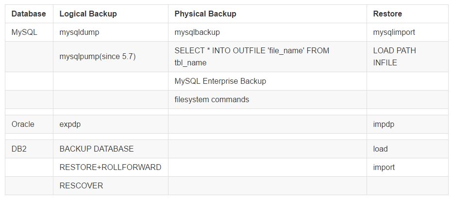

Comparision of data transfer in DB2, Oracle and MySQL

作业要求是对比 DB2 以及 Oracle 的数据导入、导出以及备份，考虑到第一次作业是有 MySQL 的，顺便也加上了。图 \ref{fig:command_names} 整理了在不同的数据库中相应的命令（限于篇幅，DB2 中的一些命令，比如 db2move 等并没有提及）。

{#fig:command_names width=80%}


# 参考资料

本文几乎全部摘录自互联网，版权归原公司/作者所有，主要参考的内容链接为：

* [MySQL 5.7 Reference Manual](https://dev.mysql.com/doc/refman/5.7/en/)
    - [5.5.4 mysqldump — A Database Backup Program](https://dev.mysql.com/doc/refman/5.7/en/mysqldump.html)
    - [5.5.5 mysqlimport — A Data Import Program](https://dev.mysql.com/doc/refman/5.7/en/mysqlimport.html)
    - [5.5.6 mysqlpump — A Database Backup Program](https://dev.mysql.com/doc/refman/5.7/en/mysqlpump.html)
    - [Chapter 8 Backup and Recovery](https://dev.mysql.com/doc/refman/5.7/en/backup-and-recovery.html)

* [Oracle Database Utilities](http://docs.oracle.com/database/122/SUTIL/)
    - [1 Overview of Oracle Data Pump](http://docs.oracle.com/database/122/SUTIL/oracle-data-pump-overview.htm#SUTIL100)
    - [2 Data Pump Export](http://docs.oracle.com/database/122/SUTIL/oracle-data-pump-export-utility.htm#SUTIL200)
    - [3 Data Pump Import](http://docs.oracle.com/database/122/SUTIL/datapump-import-utility.htm#SUTIL300)

* [Oracle Data Pump (expdp and impdp) in Oracle Database 10g](https://oracle-base.com/articles/10g/oracle-data-pump-10g)

* [DB2 Data movement utilities and reference](https://www.ibm.com/support/knowledgecenter/SSEPGG_11.1.0/com.ibm.db2.luw.admin.dm.doc/com.ibm.db2.luw.admin.dm.doc-gentopic1.html)
    - [Export utility](https://www.ibm.com/support/knowledgecenter/SSEPGG_11.1.0/com.ibm.db2.luw.admin.dm.doc/com.ibm.db2.luw.admin.dm.doc-gentopic3.html)
    - [Import utility](https://www.ibm.com/support/knowledgecenter/SSEPGG_11.1.0/com.ibm.db2.luw.admin.dm.doc/com.ibm.db2.luw.admin.dm.doc-gentopic4.html)
    - [Load utility](https://www.ibm.com/support/knowledgecenter/SSEPGG_11.1.0/com.ibm.db2.luw.admin.dm.doc/com.ibm.db2.luw.admin.dm.doc-gentopic6.html)
    - [Ingest utility](https://www.ibm.com/support/knowledgecenter/SSEPGG_11.1.0/com.ibm.db2.luw.admin.dm.doc/doc/c0057237.html)

\newpage

# 数据导入、导出

## MySQL

MySQL 提供了逻辑上以及物理上的数据库导入，在图 \ref{fig:command_names} 给出了相关的命令。

下面以例子的形式来给出每个命令的使用方法：

### mysqldump

To make a backup of an entire database:
``` vi
shell> mysqldump db_name > backup-file.sql
```
To load the dump file back into the server:
``` vi
shell> mysql db_name < backup-file.sql
```
Another way to reload the dump file:
``` vi
shell> mysql -e "source /path-to-backup/backup-file.sql" db_name
```
mysqldump is also very useful for populating databases by copying data from one MySQL server to
another:
``` vi
shell> mysqldump --opt db_name | mysql --host=remote_host -C db_name
```


### mysqlimport

``` vi
shell> mysql -e 'CREATE TABLE imptest(id INT, n VARCHAR(30))' test
shell> ed
a
100 Max Sydow
101 Count Dracula
.
w imptest.txt
32
q
shell> od -c imptest.txt
0000000 1 0 0 \t M a x S y d o w \n 1 0
0000020 1 \t C o u n t D r a c u l a \n
0000040
shell> mysqlimport --local test imptest.txt
test.imptest: Records: 2 Deleted: 0 Skipped: 0 Warnings: 0
shell> mysql -e 'SELECT * FROM imptest' test
+------+---------------+
| id | n |
+------+---------------+
| 100 | Max Sydow |
| 101 | Count Dracula |
+------+---------------+
```

### mysqlpump

mysqlpump 即 parallel mysqldump，是在版本 5.7 引入的，目前也算是比较稳定了，可以尝试。


## Oracle

### expdp

* Performing a Table-Mode Export

A table-mode export, specified using the TABLES parameter. Issue the following Data Pump export command to perform a table export of the tables employees and jobs from the human resources (hr) schema:

``` vi
expdp hr TABLES=employees,jobs DUMPFILE=dpump_dir1:table.dmp
```

* Performing a Schema-Mode Export

a schema-mode export of the `hr` schema. In a schema-mode export, only objects belonging to the corresponding schemas are unloaded. Because schema mode is the default mode, it is not necessary to specify the `SCHEMAS` parameter on the command line, unless you are specifying more than one schema or a schema other than your own.

``` vi
> expdp hr DUMPFILE=dpump_dir1:expschema.dmp LOGFILE=dpump_dir1:expschema.log
```

* Performing a Parallel Full Database Export

A full database Export that will have up to 3 parallel processes (worker or PQ slaves).
``` vi
> expdp hr FULL=YES DUMPFILE=dpump_dir1:full1%U.dmp, dpump_dir2:full2%U.dmp
FILESIZE=2G PARALLEL=3 LOGFILE=dpump_dir1:expfull.log JOB_NAME=expfull
```
Because this is a full database export, all data and metadata in the database will be exported. Dump files `full101.dmp`, `full201.dmp`, `full102.dmp`, and so on will be created in a round-robin fashion in the directories pointed to by the `dpump_dir1` and `dpump_dir2` directory objects. For best performance, these should be on separate I/O channels. Each file will be up to 2 gigabytes in size, as necessary. Initially, up to three files will be created. More files will be created, if needed. The job and master table will have a name of `expfull`. The log file will be written to `expfull.log` in the `dpump_dir1` directory.

### impdp

* Performing a Data-Only Table-Mode Import

Perform a data-only table-mode import of the table named employees. It uses the dump file created before in `Performing a Table-Mode Export`.

The `CONTENT=DATA_ONLY` parameter filters out any database object definitions (metadata). Only table row data is loaded.

``` vi
> impdp hr TABLES=employees CONTENT=DATA_ONLY DUMPFILE=dpump_dir1:table.dmp
NOLOGFILE=YES
```

* Performing a Schema-Mode Import

A schema-mode import of the dump file set created before.

``` vi
> impdp hr SCHEMAS=hr DIRECTORY=dpump_dir1 DUMPFILE=expschema.dmp
 EXCLUDE=CONSTRAINT,REF_CONSTRAINT,INDEX TABLE_EXISTS_ACTION=REPLACE
```
The `EXCLUDE` parameter filters the `metadata` that is imported. For the given mode of import, all the objects contained within the source, and all their dependent objects, are included except those specified in an `EXCLUDE` statement. If an object is excluded, then all of its dependent objects are also excluded.The `TABLE_EXISTS_ACTION=REPLACE` parameter tells Import to drop the table if it already exists and to then re-create and load it using the dump file contents.

## DB2

### export

A simple export operation requires you to specify only a target file, a file format, and a source file for the SELECT statement.

For example:
``` vi
db2 export to filename of ixf select * from table   
```
where `filename` is the name of the output file that you want to create and export, `ixf` is the file format, and table is the name of the table that contains the data you want to copy.

还可以有选择的复制：

``` vi
   db2 export to awards.ixf of ixf messages msgs.txt select * from staff
      where dept = 20
```

### import

The following example shows how to import information from `myfile.ixf` to the `STAFF` table:
``` vi
   db2 import from myfile.ixf of ixf messages msg.txt insert into staff
```

### load

The following is an example of a LOAD command issued through the CLP:
``` vi
   db2 load from stafftab.ixf of ixf messages staff.msgs
      insert into userid.staff copy yes use tsm data buffer 4000
```

In this example:

Any warning or error messages are placed in the staff.msgs file.
A copy of the changes made is stored in Tivoli® Storage Manager (TSM).
4000 pages of buffer space are to be used during the load operation.


# 数据库备份


## 不同的备份类型

下面摘自 MySQL 文档，其概念也适用于其他数据库。

This section describes the characteristics of different types of backups.

### Physical (Raw) Versus Logical Backups

Physical backups consist of raw copies of the directories and files that store database contents. This type of backup is suitable for large, important databases that need to be recovered quickly when problems occur.

Logical backups save information represented as logical database structure (CREATE DATABASE, CREATE TABLE statements) and content (INSERT statements or delimited-text files). This type of backup is suitable for smaller amounts of data where you might edit the data values or table structure, or recreate the data on a different machine architecture.

### Online Versus Offline Backups

Online backups take place while the MySQL server is running so that the database information can be obtained from the server. Offline backups take place while the server is stopped. This distinction can also be described as “hot” versus “cold” backups; a “warm” backup is one where the server remains running but locked against modifying data while you access database files externally.

### Local Versus Remote Backups

A local backup is performed on the same host where the MySQL server runs, whereas a remote backup is done from a different host. For some types of backups, the backup can be initiated from a remote host even if the output is written locally on the server host.

### Snapshot Backups

Some file system implementations enable “snapshots” to be taken. These provide logical copies of the file system at a given point in time, without requiring a physical copy of the entire file system. (For example, the implementation may use copy-on-write techniques so that only parts of the file system modified after the snapshot time need be copied.) 


### Full Versus Incremental Backups

A full backup includes all data managed by a MySQL server at a given point in time. An incremental backup consists of the changes made to the data during a given time span (from one point in time to another). MySQL has different ways to perform full backups, such as those described earlier in this section. Incremental backups are made possible by enabling the server's binary log, which the server uses to record data changes.

### Full Versus Point-in-Time (Incremental) Recovery

A full recovery restores all data from a full backup. This restores the server instance to the state that it had when the backup was made. If that state is not sufficiently current, a full recovery can be followed by recovery of incremental backups made since the full backup, to bring the server to a more up-to-date state.

Incremental recovery is recovery of changes made during a given time span. This is also called `point-in-time` recovery because it makes a server's state current up to a given time. `Point-in-time` recovery is based on the binary log and typically follows a full recovery from the backup files that restores the server to its state when the backup was made. Then the data changes written in the binary log files are applied as incremental recovery to redo data modifications and bring the server up to the desired point in time.


具体的方式主要是利用每个数据库对应的 `export` 来导出数据，利用 `import` 来加载数据，不同的数据库可能在处理数据量较大的数据库时有更加便利的方法，比如 `load` 等，其语法很相似，限于篇幅，此处不再赘述。