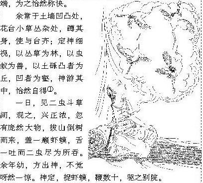

% The answer to life, the universe, and everything
% MiaoDX 缪东旭 MiaoDX@hotmail.com
% April 5, 2017

# Quick Question

## Recap the question asked just now.

>The answer to life, the universe, and everything
>
--『The Hitchhiker's Guide to the Galaxy』

Disclaimer: All things here is just my own opinion, just treat it as a joke if you really disagree.

## When/how can a man be a God?

* Daydream
* Imagination
* Some games
* Really sick :)

Or, 

---

when he is young.

## Could it be technically possible for human to be god?

* Clone/Gene Tech
* Nuclear power
* Robots, computer, AI

# AI

## Brief intro of AI

[TODO]

## What can AI/robots do now?

* AlphaGo
* Self-driving Car
* Machine Translation
* Chatbot
* Sweeping Robots
* Factory Robots

## All Tech Giants Are Playing AI

* Google-Alphabet
* Amazon
* Facebook
* Microsoft
* IBM

[X]

* BAT
* Didi

## Computer Vision

{#fig:obamafunny width=50%}

Ref:[The state of Computer Vision and AI: we are really, really far away.](https://karpathy.github.io/2012/10/22/state-of-computer-vision/)