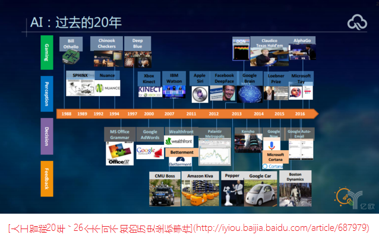
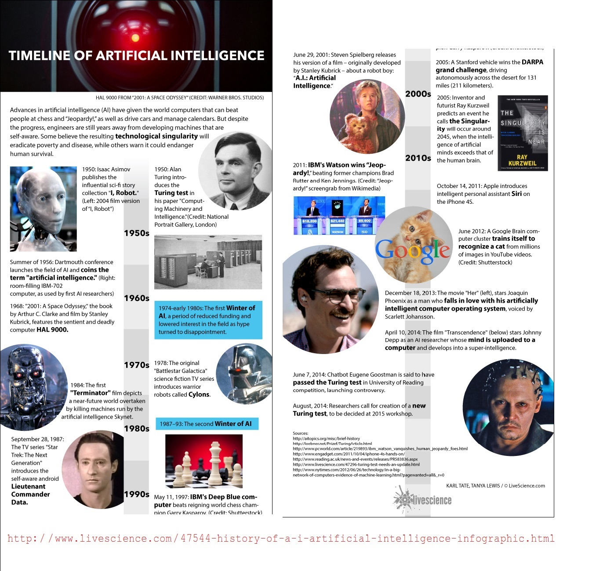

% The answer to life, the universe, and everything
% MiaoDX 缪东旭 MiaoDX@hotmail.com
% April 5, 2017

# Quick Question

## Recap the question asked just now.

>The answer to life, the universe, and everything
>
--『The Hitchhiker's Guide to the Galaxy』

. . .

Disclaimer: 

All things here are just my own opinions,  just treat them as jokes if you really disagree.

## When/how can a man be a God?

* Daydream
* Imagination
* Some games
* Really sick :)

. . .

Or, 

---

When he is young.

## Could it be technically possible for a human to be a god?

* Clone/Gene Tech => GMF(genetically modified food)
* Nuclear Power
* Robots, Computer, AI

Genetically [dʒə'nɛtɪklɪ] modified, corn, soybean ['sɔibi:n]

Ethical debate of human cloning

Hydrogen ['haɪdrədʒ(ə)n] bomb

Atomic [ə'tɒmɪk] bomb

# AI

## Brief intro of AI

{#fig:ai_history_1 width=80%}

Ref: [人工智能20年，26个不可不知的历史坐标事件](http://iyiou.baijia.baidu.com/article/687979)

---

{#fig:ai_history_2 width=60%}

Ref: [History of A.I.: Artificial Intelligence (Infographic)](http://www.livescience.com/47544-history-of-a-i-artificial-intelligence-infographic.html)

## What can AI/robots do now?

* AlphaGo
* Self-driving Car
* Machine Translation
* Chatbot
* Sweeping Robots
* Factory Robots
* [...]

## All Tech Giants Are Playing AI

* [Foreign Companies]
    - Google-Alphabet
    - Amazon
    - Facebook
    - Microsoft
    - IBM

. . .

* [Chinese Companies]
    - BAT
    - Didi

. . .

* And, universities all over the world.

# So, AI is around the corner?

## Computer Vision

. . .

{#fig:obamafunny width=50%}

Ref: [The state of Computer Vision and AI: we are really, really far away. Oct 22, 2012](https://karpathy.github.io/2012/10/22/state-of-computer-vision/)

# The Future

---

>不识庐山真面目，只缘身在此山中
> -- 苏轼『题西林壁』

. . .

150 years ago, there were no cars, now we send human into outer space.

. . .

30 years ago (Sep. 1987), China sent out the first email:

>Across the Great Wall we can reach every corner in the world
>（越过长城，走向世界）

Now, almost everyone has the access to Internet.

. . .

25 years ago, most of us have not come into this world, now, we are... 

## So, just image

You have a partner:

* who can cheer you up when you're upset
* who can always chat to you or keep silent as you wish
* who remember each and every stuff you need to keep in mind
* who take care of your health like an outstanding doctor or expert coach in gym
* who make you breakfast, lunch, and supper like a chief cook of restaurant in "Le Guide Michelin"
* who looks exactly like the one you want to marry in dream but have no chance in reality
* who can also kid around if you want that

---

PLEASE add the list as you wish.

. . .

Just one tiny issue, he/she is a robot under a perfect human skin with emotion just like a human.

. . .

>A: So, what do you think?
>
>B: I don't buy it, but will buy if true.

## A new world

* you have the power to choose whoever you are, do whatever you want to do
* you don't have to work extremely hard in your whole life to pay for a room less than $100m^2$
* you don't have to spend years with a girl/boy and being left alone
* you don't have to suffer relatives or very close friends pass away

---

Just like the former one, the only issue is all there are virtual, but so real that you just cannot tell the difference.

. . .

Maybe you think it disgusting, then, just treat it as a pill for some who really need a big lie to keep alive.

. . .

Or maybe

Someone insane just starts the nuclear war, and like what has been said in the Bible:

---

>${}^{10}$但主的日子要像贼来到一样；那日，天必大有响声废去，有形质的都要被烈火销化，地和其上的物都要烧尽了。
>
> -- 『新约·彼得后书·第三章』

>${}^{10}$But Jehovah’s day will come as a thief, in which the heavens will pass away with a roar, but the elements being intensely hot will be dissolved, and earth and the works in it will be exposed.
>
> -- 『2 Peter. 3:10 Christian Greek Scriptures』

## Mission & Vision

I do hope maybe 42 years later, I can introduce robots or AI like I described before to the public.

# Thanks  &  Any Questions?