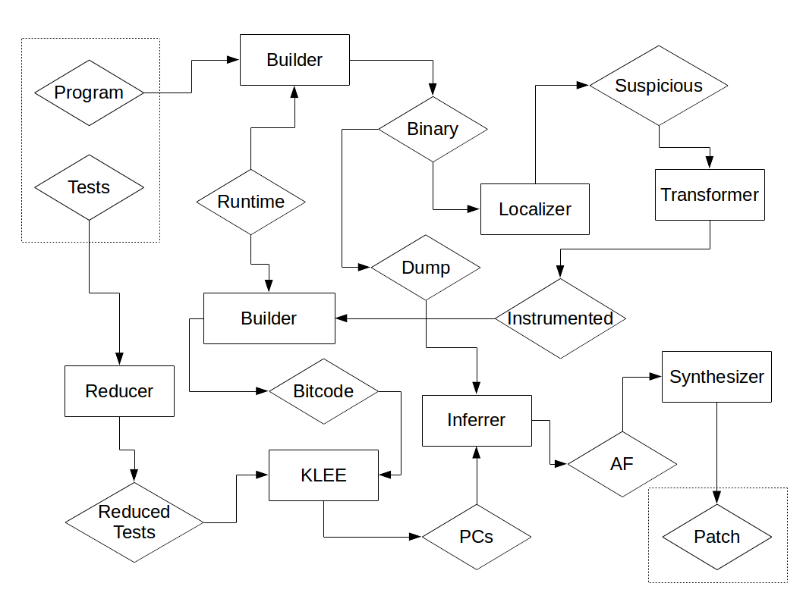
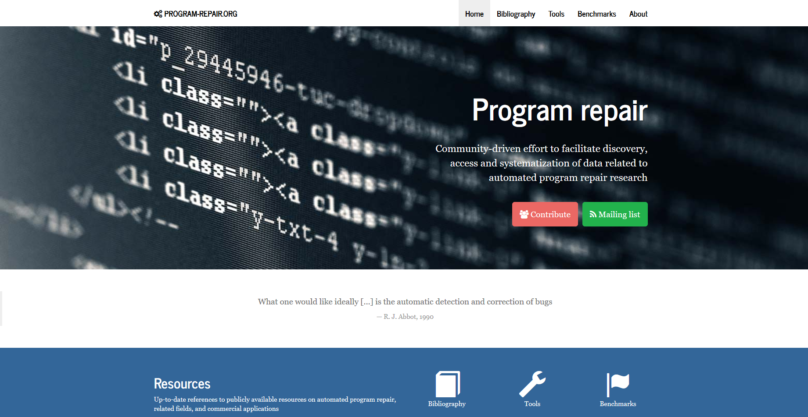
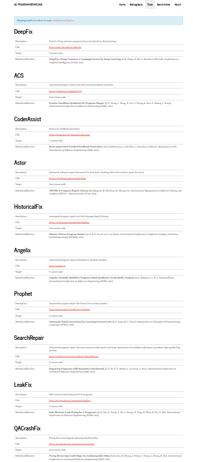

% Software Testing Project <br> SemFix
% 2016218037 刘莞姝 <br> 2016218040 马舒婕 <br> 2016218046 滕　飞 <br> 2016218055 杨宇杰 <br>  2016218041 缪东旭（组长）<br>
% May 19, 2017

## What are we going to talk about?

. . .

Automated program repair / automatic bug fixing

***


>Automated program repair (automatic bug fixing) is an emerging area of research that focuses on **reducing the cost** of software bug fixing. Automated program repair approaches **automatically** or **semi-automatically** modify buggy program to satisfy given **correctness criteria**. Examples of correctness criteria are **test suite** and **formal specification**. Typical program repair works in the following **three steps**: identifying faulty locations, inferring desired specification, and generating a patch. Existing approaches differ in the underlying techniques used for localization, inference, and patch generation. Roughly, they can be divided into **two groups**: **syntactical** (e.g., GenProg) and **semantical** (e.g., SemFix). Important attributes of automated program repair are scalability, repairability, and reliability of generated patches. <br> <br> -- Copied from [program-repair.org](http://program-repair.org/about.html)

***

## Why dose it matter?

. . .

> It is all about TRADEOFF

. . .

Let's assume that:

* code complexity
* human resources
* compiler

***

## The output of <br> automated program repair

>Automated program repair approaches **automatically** or **semi-automatically** modify buggy program to satisfy given correctness criteria.

* Guidelines?
* Solutions?

## Paper we choose

SemFix: Program Repair via Semantic Analysis

. . .

Compared with [GenProg](http://dijkstra.cs.virginia.edu/genprog/), SemFix (or Angelix) is:

* newer -- 2012 vs 2016 (first paper 2013)
* better -- comparison in paper
* more open source -- hosted on Github
* less materials -.-

***

## Analysis of chosen paper

[... Efforts needed]

* error types can be corrected
* the pipeline
* results

### error types can be corrected

* if-conditions
* loop-conditions
* assignments
* guards


## Examples

***

### Example#1

``` cpp

int addOneWhenPositive(int x) {
  int r = 0;
  if(x > 0){
    r = x - 1;
  }
  else{
   r = x;
  }

  return r;
}
```

. . .

Test cases:

``` vi
TC#1: (-1;-1)
TC#2: (0;0)
TC#3: (1;2)
```

. . .

``` vi
angelix src test.c oracle 1 2 3 --assert assert.json
```

Patch we got:

``` patch
--- a/test.c
+++ b/test.c
@@ -7,7 +7,7 @@
 int addOneWhenPositive(int x) {
   int r = 0;
   if(x > 0){
-    r = x - 1;
+    r = (x + 1);
   }
   else{
    r = x;
```

***

``` vi
angelix src test.c oracle 1 2 3 --assert assert.json --semfix
```

Patch we got:

``` patch
--- a/test.c
+++ b/test.c
@@ -7,7 +7,7 @@
 int addOneWhenPositive(int x) {
   int r = 0;
   if(x > 0){
-    r = x - 1;
+    r = 2;
   }
   else{
    r = x;
```

***

### Example#2

``` cpp
/*
* This code is copied from class material Ch02- Software Testing Foundations.pptx
*/
public static int numZero (int [ ] arr)
{  // Effects: If arr is null throw NullPointerException
   // else return the number of occurrences of 0 in arr
   int count = 0;
   for (int i = 1; i < arr.length; i++)
   {
      if (arr [ i ] == 0)
      {
         count++;
      }
   }
   return count;
}
```

. . .

Test cases:

``` vi
TC#1: ([1,2,3];0)
TC#2: ([1,2,0];1)
TC#3: ([0,1,2];1)
```

***

And, since we use this example, maybe you are wondering about these:

* Fault
* Error
* Failure

***

### Example#2.2

Test cases#2:

``` vi
TC#1: (-1;0)
```


***

### Example#3, EASY is relative

``` cpp
int addOne(int x){
    return x-1
}
```

. . .

Test cases:

``` vi
TC#1: (-1;0)
TC#2: (0;1)
TC#3: (1;2)
```

. . .

We got:

``` vi
[...]
WARNING  repair          no suspicious expressions localized
[...]
```

. . .

``` cpp
int addOne(int x) {
  int r = x - 1;
  return r;
}
```

. . .

Still no good luck.

***

SO,

>Automated program repair approaches automatically or semi-automatically modify buggy program to satisfy given **correctness criteria**. Examples of correctness criteria are **test suite** and **formal specification**. 

***

## Build from source & lesson learned

We failed to build it in various ways, if you are interested, you can look more detail in our [write-up](../angelix.md).

Lesson learned:

* environment variables
* make install
* `master` branch of codebase

## Architecture of the program

{width=65%}

***

A simplified version:

[...]

***

## What's Next?

There are many other research topics and tools for automated program repair, if you are interested and want to have a try, please refer to [program-repair.org](http://program-repair.org/index.html) for more info.


<div id="fig:program_repair">
{width=70%}
{width=20%}
</div>


## That's all, thanks!

> Good luck & have fun

Team member:

2016218037 刘莞姝 <br> 2016218040 马舒婕 <br> 2016218041 缪东旭 <br> 2016218046 滕　飞 <br> 2016218055 杨宇杰 <br>