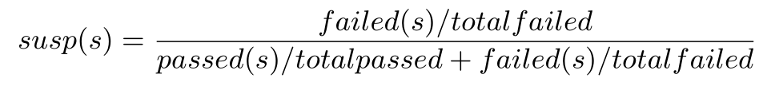
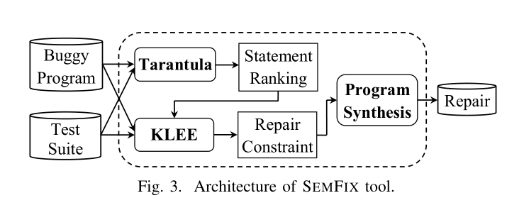
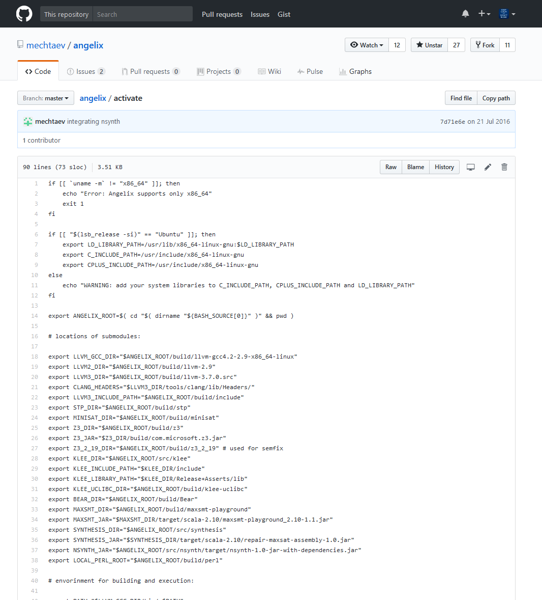
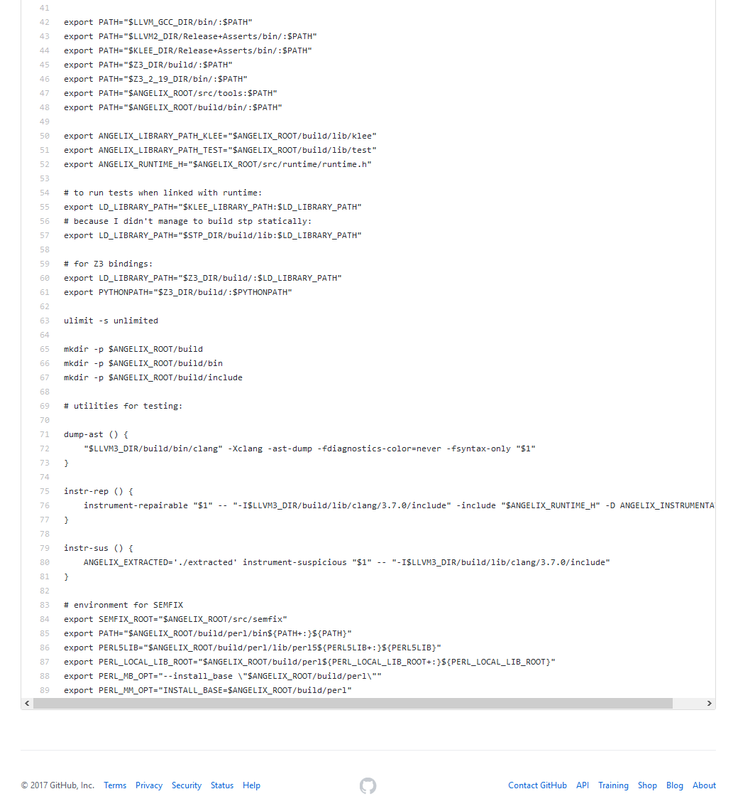

% Software Testing Project <br> SemFix
% 2016218037 刘莞姝 <br> 2016218040 马舒婕 <br> 2016218046 滕　飞 <br> 2016218055 杨宇杰 <br>  2016218041 缪东旭（组长）<br>
% May 19, 2017

## What are we going to talk about?

. . .

Automated program repair / automatic bug fixing

***


>Automated program repair (automatic bug fixing) is an emerging area of research that focuses on **reducing the cost** of software bug fixing. Automated program repair approaches **automatically** or **semi-automatically** modify buggy program to satisfy given **correctness criteria**. Examples of correctness criteria are **test suite** and **formal specification**. Typical program repair works in the following **three steps**: identifying faulty locations, inferring desired specification, and generating a patch. Existing approaches differ in the underlying techniques used for localization, inference, and patch generation. Roughly, they can be divided into **two groups**: **syntactical** (e.g., GenProg) and **semantical** (e.g., SemFix). Important attributes of automated program repair are scalability, repairability, and reliability of generated patches. <br> <br> -- Copied from [program-repair.org](http://program-repair.org/about.html)

***

## Why dose it matter?

. . .

> It is all about TRADEOFF

. . .

Let's assume that:

* code complexity
* human resources
* compiler

***

## The output of <br> automated program repair

>Automated program repair approaches **automatically** or **semi-automatically** modify buggy program to satisfy given correctness criteria.

* Guidelines?
* Solutions?

## Paper we choose

SemFix: Program Repair via Semantic Analysis

. . .

Compared with [GenProg](http://dijkstra.cs.virginia.edu/genprog/), SemFix (or Angelix) is:

* newer -- 2012 vs 2016 (first paper 2013)
* better -- comparison in paper
* more open source -- hosted on Github
* less materials -.-

***

## Analysis of chosen paper

> present an automated repair method based on symbolic execution, constraint solving and program synthesis


* Statistical Fault Localization

. . .

{width=50%}

* Statement-level specification inference
* Program synthesis

<div class="notes">
I am not sure why this can not be generated nicely

$$susp(s) = \frac{failed(s)/totalfailed}{passed(s)/totalpassed + failed(s)/totalfailed}$$
</div>


***

{width=65%}

. . .

* Tarantula technique
    - rank statements according to suspiciousness score
* KLEE
    - generate repair constraints
* Z3 SMT (satisfiability modulo theories) solver
    - solve a repair constraint
* Program synthesis
    - provided by the author

***

### error types can be corrected

* if-conditions
* loop-conditions
* assignments
* guards

## Examples

***

### Example#1 addOneWhenPositive (I)

``` cpp
int addOneWhenPositive(int x) {
  int r = 0;
  if(x > 0){
    r = x - 1;
  }
  else{
   r = x;
  }

  return r;
}
```

. . .

Test cases:

``` vi
TC#1: (-1;-1)
TC#2: (0;0)
TC#3: (1;2)
```

. . .

``` vi
angelix src test.c oracle 1 2 3 --assert assert.json
```

Patch we got:

``` patch
--- a/test.c
+++ b/test.c
@@ -7,7 +7,7 @@
 int addOneWhenPositive(int x) {
   int r = 0;
   if(x > 0){
-    r = x - 1;
+    r = (x + 1);
   }
   else{
    r = x;
```

***

### Example#1 addOneWhenPositive (II)

``` vi
angelix src test.c oracle 1 2 3 --assert assert.json --semfix
```

Patch we got:

``` patch
--- a/test.c
+++ b/test.c
@@ -7,7 +7,7 @@
 int addOneWhenPositive(int x) {
   int r = 0;
   if(x > 0){
-    r = x - 1;
+    r = 2;
   }
   else{
    r = x;
```


***

And, recap what we learned in our class, there are three conceptions about bug:

* Fault
* Error
* Failure

***

### Example#1 addOneWhenPositive (III)

``` cpp

int addOneWhenPositive(int x) {
  int r = 0;
  if(x > 0){
    r = x - 1;
  }
  else{
   r = x;
  }

  return r;
}
```

. . .

With test cases:

``` vi
TC#1: (-1;-1)
TC#2: (0;0)
```

. . .

``` vi
angelix src test.c oracle 1 2 3 --assert assert.json --semfix
```


``` vi
INFO     project         configuring validation source
INFO     project         building json compilation database from validation source
INFO     testing         running test '1' of validation source
INFO     testing         running test '2' of validation source
INFO     project         configuring frontend source
INFO     transformation  instrumenting repairable of frontend source
INFO     project         building frontend source
INFO     repair          running positive tests for debugging
INFO     testing         running test '1' of frontend source
INFO     testing         running test '2' of frontend source
INFO     repair          repair test suite: ['1', '2']
INFO     repair          validation test suite: ['1', '2']
INFO     localization    No negative test exists
```

***

SO,

>Automated program repair approaches automatically or semi-automatically modify buggy program to satisfy given **correctness criteria**. Examples of correctness criteria are **test suite** and **formal specification**. 

***

## Build from source & lesson learned

We failed to build it in various ways, if you are interested, you can look more detail in our [write-up](../angelix.md).

Lesson learned:

* environment variables
* make install
* `master` branch of codebase

. . .

And

* share compressed file (>9 GB vs 2.80 GB)
* build in a better PC

***

<div id="fig:program_repair">
{width=48%}
{width=48%}
</div>

export PATH by providing a `profile` file <br>
[https://github.com/mechtaev/angelix/blob/master/activate](https://github.com/mechtaev/angelix/blob/master/activate)

## workflow of the program

{width=65%}

***

## Limits

* Generalization of the fix
    - rely on the test suite
* Other statistical debugging metrics
    - {width=50%}
    - > A statement exercised by more failing tests and fewer passing tests will have a higher suspiciousness score.
* Other

***

### Example#3 semfix inc

``` cpp
// Change from the original semfix inc
// https://github.com/mechtaev/angelix/blob/master/tests/semfix/src/test.c

#include <stdio.h>

#ifndef ANGELIX_OUTPUT
#define ANGELIX_OUTPUT(type, expr, id) expr
#endif

int inc(int i) {
  return i - 1; // +
}

int main(int argc, char *argv[]) {
  int x, n;
  x = atoi(argv[1]);
  n = inc(x);
  printf("%d\n", ANGELIX_OUTPUT(int, n, "n"));
  return 0;
}
```

. . .

``` vi
TC#1: (1;2)
TC#2: (2;3)
TC#3: (3;4)
```

. . .

``` vi
angelix src test.c oracle 1 2 3 --assert assert.json --semfix --synthesis-level variables
```

``` patch
--- a/test.c
+++ b/test.c
@@ -11,7 +11,7 @@
 int main(int argc, char *argv[]) {
   int x, n;
   x = atoi(argv[1]);
-  n = inc(x);
+  n = (1 + x);
   printf("%d\n", ANGELIX_OUTPUT(int, n, "n"));
   return 0;
 }
```


***

### Example#4 for-loop (I)

``` cpp
// The original for-loop
// https://github.com/mechtaev/angelix/blob/master/tests/for-loop/src/test.c

#include <stdio.h>

#ifndef ANGELIX_OUTPUT
#define ANGELIX_OUTPUT(type, expr, id) expr
#endif

int main(int argc, char *argv[]) {
  int n;
  n = atoi(argv[1]);
  for (n = n - 1; n > 0; n--) { // >=
    printf("%d\n", ANGELIX_OUTPUT(int, n, "n"));
  }
  return 0;
}
```

. . .

Test cases:

``` vi
TC#1: (2;[1, 0])
TC#2: (3;[2, 1, 0])
TC#3: (4;[3, 2, 1, 0])
```

. . .

``` vi
angelix src test.c oracle 1 2 3 --assert assert.json --klee-max-forks 5 --defect loop-conditions
```

``` patch
--- a/test.c
+++ b/test.c
@@ -7,7 +7,7 @@
 int main(int argc, char *argv[]) {
   int n;
   n = atoi(argv[1]);
-  for (n = n - 1; n > 0; n--) { // >=
+  for (n = n - 1; (n >= 0); n--) { // >=
     printf("%d\n", ANGELIX_OUTPUT(int, n, "n"));
   }
   return 0;
```


*** 

### Example#4 for-loop (II)

However, if we change the start point

``` cpp
#include <stdio.h>

#ifndef ANGELIX_OUTPUT
#define ANGELIX_OUTPUT(type, expr, id) expr
#endif

int main(int argc, char *argv[]) {
  int n;
  n = atoi(argv[1]);
  for (n = n - 2; n >= 0; n--) { // >=
    printf("%d\n", ANGELIX_OUTPUT(int, n, "n"));
  }
  return 0;
}
```

. . .

Same `oracle`, `assert.json` and command as before, but 

``` vi
[...]
INFO     inference       found 0 angelic paths for test '1'
INFO     repair          no patch generated in 8s
FAIL
```


## What's Next?

There are many other research topics and tools for automated program repair, if you are interested and want to have a try, please refer to [program-repair.org](http://program-repair.org/index.html) for more info.


<div id="fig:program_repair">
{width=70%}
{width=20%}
</div>


## That's all, thanks!

> Good luck & have fun

Team member:

2016218037 刘莞姝 <br> 2016218040 马舒婕 <br> 2016218041 缪东旭 <br> 2016218046 滕　飞 <br> 2016218055 杨宇杰 <br>