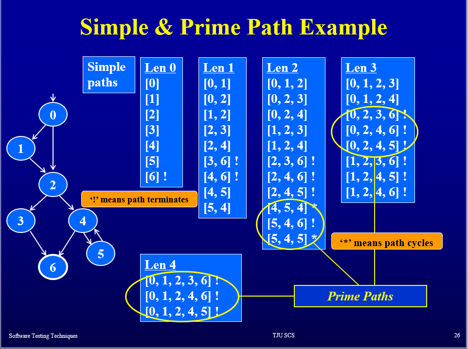
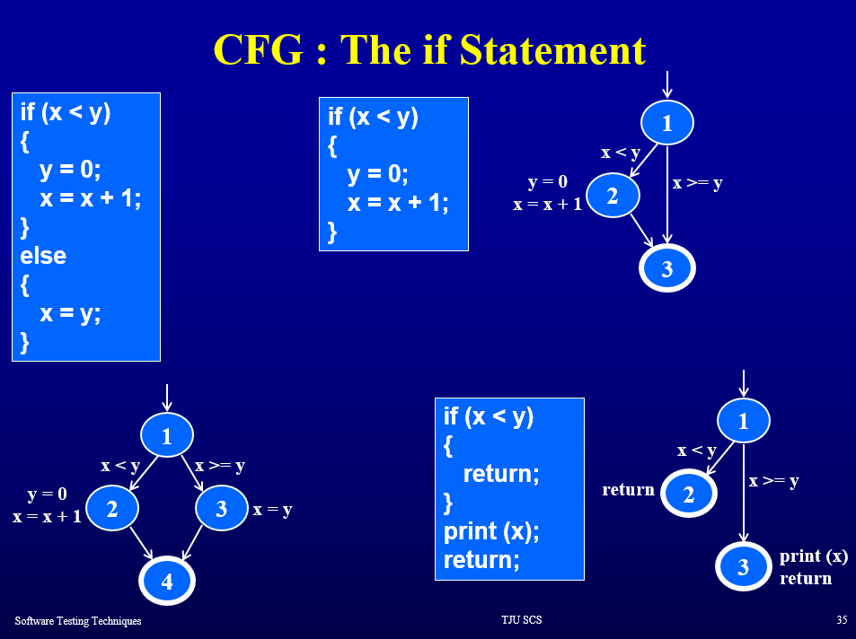
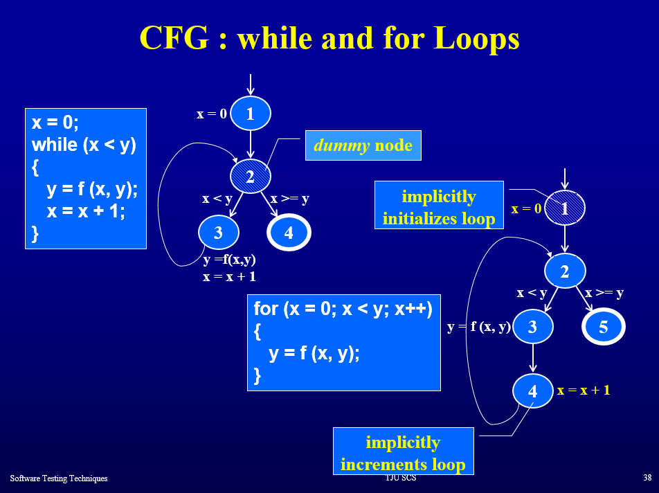
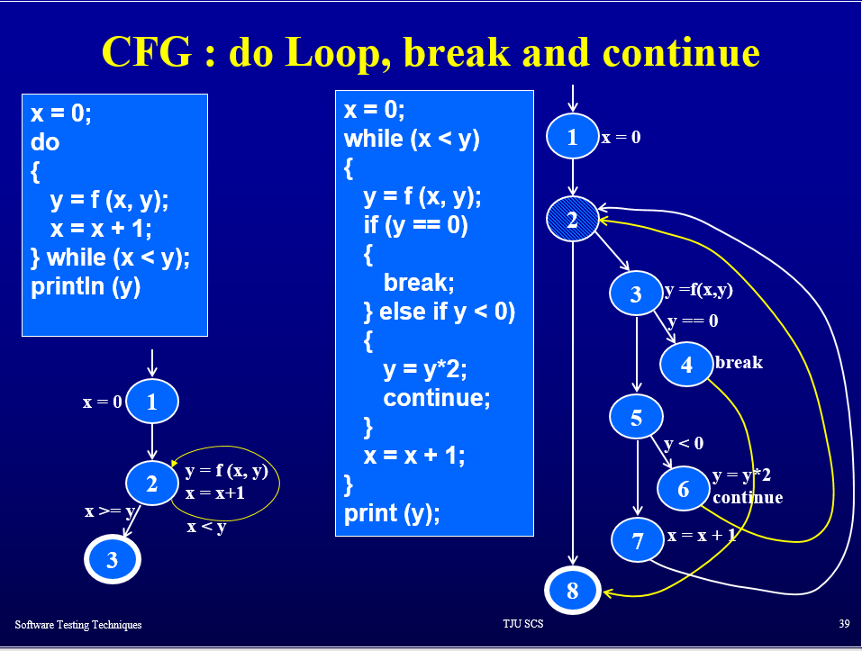
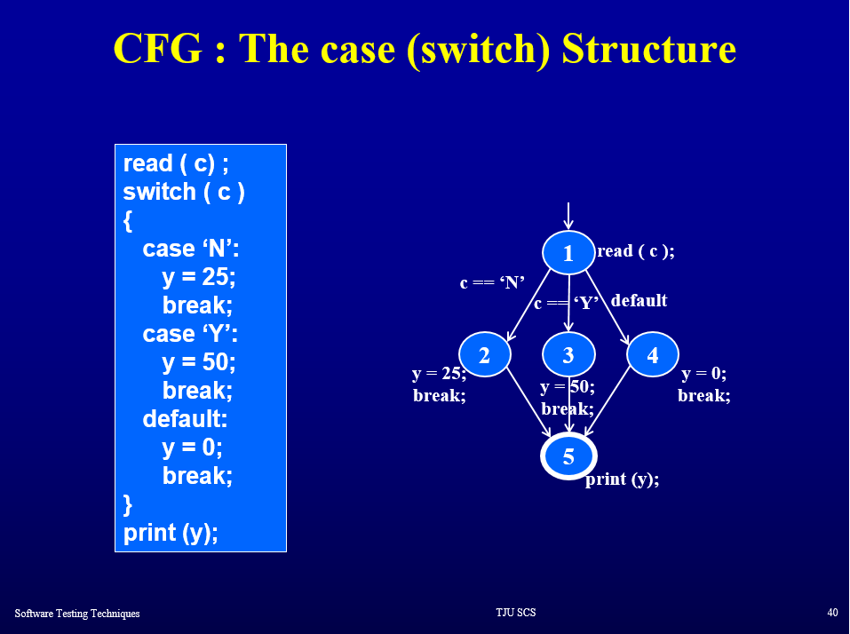

# Slides Notes (and exam preparation)

## Ch01-Introduction

Software Testing ==(in some view) Verification (do thing right) + Validation (do right thing)

## Ch02-ST Foundations

### Terminology

* Fault: the mistake in code
* Error: execute the wrong code
* Failure: execute the wrong code and get wrong output


RIP model: three conditions for a failure to be observed:

* Reachability: wrong code can be executed
* Infection: wrong code executed and cause somewhat wrong in program
* Propagation: wrong results

## Ch04-Graph Coverage

* Control flow graph coverage
* Data flow graph coverage

### reach

* syntactic reach: a subpath exists in the graph
* semantic reach: a test exists that can execute that subpath

### Types of graph coverage

* NC, Node Coverage
* EC, Edge Coverage
* EPC, Edge-Pair Coverage
* CPC, Complete Path Coverage
* SPC, Specified Path Coverage
* PPC, Prime Path Coverage (see below)


As for graph with loops:

* Simple Path: No repeat node expect in possibly first and last node are same situation.
* Prime Path: SP, and not subpath of other SP.


Example of Prime Path:

{#fig:pp_example width=50%}


### CFG, Control Flow Graph

The `dummy`/`extra` nodes when `loops` are presented.

And there are some examples of common used control flow statements:

{#fig:if width=50%}

{#fig:while_for width=50%}

{#fig:do_loop width=50%}

{#fig:switch width=50%}


## Ch05-Logic Coverage

Types of logic coverage:

* Decision Coverage (i.e. branch coverage)
* Condition Coverage
* Condition/Decision Coverage
* Multiple-condition Coverage
* MC/DC (Modified condition/decision coverage) Coverage


Decision & Condition:

* Decision: ans of an expression with possible many boolean operator `and`,`or`,`not`
* Condition: individual boolean expression (with no boolean operator)

An easy example:

``` cpp
if(A && B){
    [...]
}
else{
    [...]
}
```

* Decision Coverage: 

Only need the answer of `if` expression be `true` and `false` once, test case can be:
`(A=true,B=true), (A=true,B=false)`.

Note that, in both case A is always true, so Condition Coverage is not achieved.

* Condition Coverage:

Test cases can be `(A=true,B=false),(A=false,B=true)`, thus DC is not achieved.

* Condition/Decision Coverage:

Cover both, but still need not to cover all possible combination:

`(true,true),(false,false)` is enough.

* Multiple Condition Coverage

All possible combination, $2^k$ cases.

* MC/DC (Modified Condition/Decision Coverage):

`Each` simple condition within the compound condition has an `independent effect` on its outcome.


``` vi
T1 (true,true) true
T2 (false,true) false
T3 (true,false) false
```

Thus, T1 and T2 can cover C1, T1 and T3 can cover C2.


SO, `MCC > MC/DC > (CC, DC)`.

Note: `>` means stronger, not `contains`. For example, a `CC` test case can be `(true, true), (false, false)`, in which case, `(false, false)` is not an element of MC/DC test cases.

## Ch06-Blackbox Testing

### Single input parameter blackbox testing

* Equivalence class partitioning (ECP, 等价类), integer: {negative/zero/positive}
* Boundary value analysis (BVA, 边界值), the boundary cases for each equivalence class in ECP, integer: {MAX_INT, MAX_INT-1, -1, 0, 1, MIN_INT+1, MIN_INT}
* Cause-effect graph and decision table (因果图与决策表)

### Decision table:

According to the provided Policy, make a table contains Condition + Action. 

And simplify this table as much as possible (Some conditions will lead to the same action no matter they are true or not).

Design test case for each column of decision table.

### Cause-effect graph:

Make cause-effect graph and translate it to decision table.


### Combination of input parameters

Pairwise methods.
>绝大部分缺陷是在两个变量取值冲突的测试被发现的。


## Ch08-TDD,Stub and Mock

* Stub: 对真实对象的模拟，显性存在，关注状态（state testing）
* Mock: 模拟出一个被模拟对象的实例，隐形存在，关注交互（interaction testing）

## Ch09-Load Testing

* Load test, 负载测试
* Stress test, how application behaves under maximum load
* Performance test